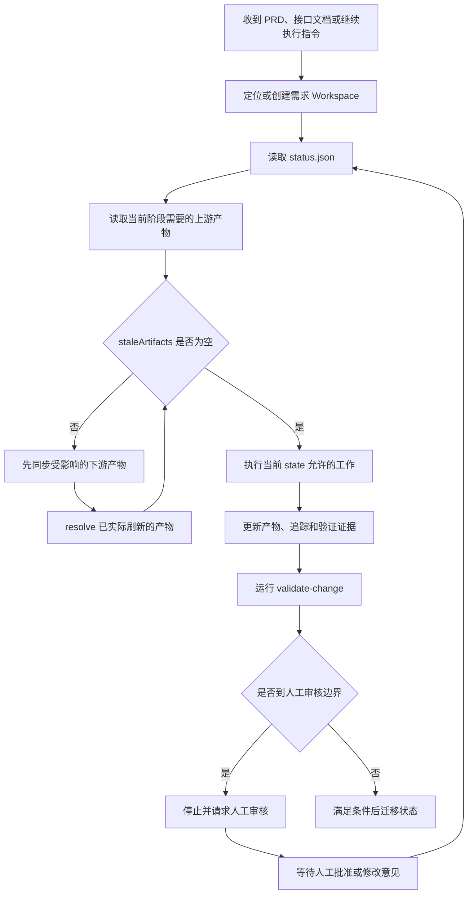
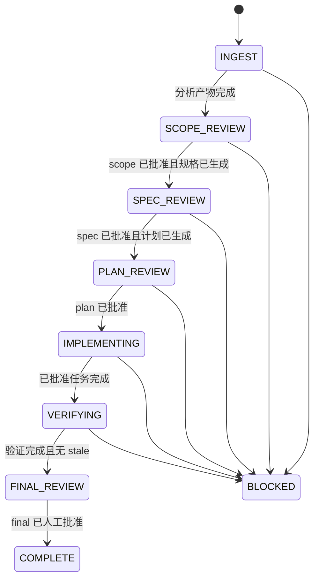
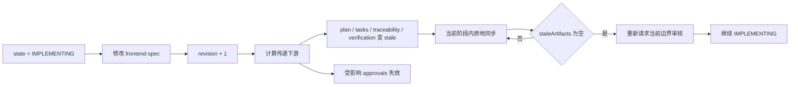
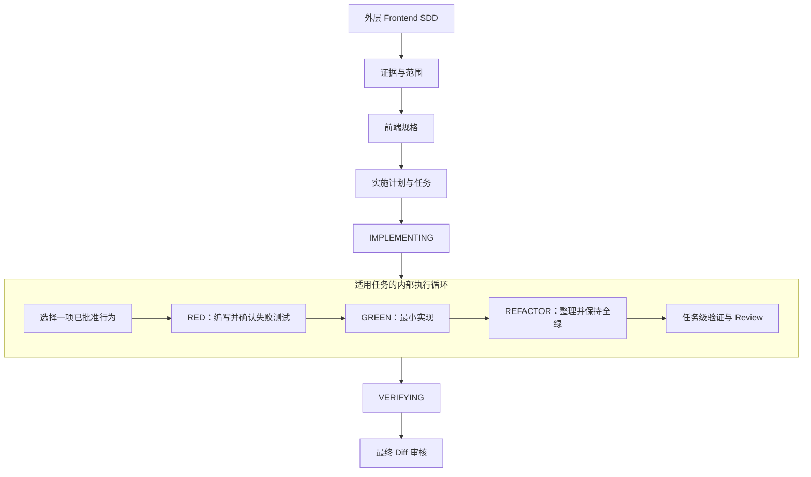

# Frontend SDD 工作流：执行策略、状态机与方案对比

> 项目：Frontend Work Flow  
> 版本基线：`feat/sdd-workflow-v0.2`  
> 使用范围：公司现有前端项目的 PRD / 接口文档 → 技术方案 → 代码 → 验证  
> 核心原则：证据先行、人工决策、真实项目执行、过程可追踪、需求变化可同步

## 1. 项目概述

当前 Coding Agent 已经具备较强的代码检索和修改能力，但“把 PRD 发给 AI”与“得到可交付代码”之间仍然存在一段高风险链路：

- PRD、接口文档和原型可能不完整或互相冲突。
- 前端需求中经常混有后端数据处理和其他仓库职责。
- AI 容易把合理推断当作正式需求。
- 通用技术方案可能没有映射到真实项目文件。
- 需求中途变化后，旧方案、旧任务和旧验证结果可能继续被使用。
- 最终代码很难反查由哪条需求授权、经过了什么验证。

本工作流不是让 AI 一次性完成全部开发，而是把 PRD 到代码的隐性过程变成一条有状态、有产物、有人工审核、有最终证据的执行链。

## 2. 工作流要解决的问题

| 实际问题 | 传统自然语言直接开发 | 当前工作流的处理方式 | 预期结果 |
| --- | --- | --- | --- |
| PRD 表述存在歧义 | Agent 自行补全 | 证据标签 + `open-questions.md` + 范围审核 | 推断不会直接进入代码 |
| 前后端职责混杂 | 容易生成越界实现 | 前端行为、后端数据、接口契约、跨仓库事项分类 | 只实施当前前端仓库拥有的行为 |
| 方案脱离项目实际 | 生成通用技术建议 | 读取真实依赖、锁文件、配置、源码和 Git 状态 | 方案映射到真实文件和符号 |
| 一次生成代码过多 | 最后才发现理解错误 | 范围、规格、计划、最终 Diff 四类审核边界 | 错误更早暴露 |
| 需求中途修改 | 依靠人工记忆同步文档 | artifact graph 传播 stale，失效相关批准 | 不再使用过期上下文 |
| 会话中断或更换 Agent | 重新解释上下文 | Workspace 保存状态和结构化产物 | 可以从当前阶段继续 |
| 本地已有未提交改动 | 与 AI 修改混在一起 | 记录基线、初始改动和重叠文件 | Review 时明确风险 |
| 改动文件分散 | 需要人工在仓库中查找 | 软链索引 + 文件清单 + Patch | 快速聚焦本需求 |

## 3. 当前执行策略

### 3.1 一次 Agent 执行的控制循环

Agent 每次被调用时，不是从头执行完整流程，而是读取当前需求的状态，只完成当前允许的阶段。

### 3.2 执行原则

| 执行策略 | 具体规则 | 解决的问题 |
| --- | --- | --- |
| 当前阶段执行 | 根据 `status.json.state` 决定动作，不一次性跑完整流程 | 控制单次改动范围 |
| 证据驱动 | 重要结论必须来自文档、用户确认或代码证据 | 防止 AI 自行发明需求 |
| 真实项目执行 | AI 直接在开发者当前项目检索、修改和验证 | 保证人与 AI 环境一致 |
| 任务级实施 | 一次只执行一个已批准任务 | 让 Diff 更小、更容易检查 |
| 已有改动保护 | 初始化时记录工作区原有修改 | 避免覆盖或错误归因 |
| 阶段门禁 | 到审核点必须停止，AI 不能代替人批准 | 保留产品与技术决策权 |
| 一致性优先 | 存在 stale 产物时禁止继续过门禁 | 防止旧方案驱动新代码 |
| 外部写入隔离 | 默认不 commit、push、PR、merge、deploy | 不扩大 Agent 权限边界 |

### 3.3 完整阶段执行

| 阶段 | Agent 的工作 | 主要产物 | 人工动作 |
| --- | --- | --- | --- |
| `INGEST` | 读取输入和真实项目；整理证据、范围与问题 | `source-index.md`、`evidence.md`、`scope.md`、`open-questions.md` | 审核前端范围和职责 |
| `SCOPE_REVIEW` | 停止执行并展示范围结论 | `approvals.scope` | 批准或修改 |
| `SPEC_REVIEW` 前 | 将批准范围转成可观察前端行为和验收标准 | `frontend-spec.md`、`acceptance.md`、`traceability.md` | 审核行为、空态、失败态和契约 |
| `SPEC_REVIEW` | 停止执行并展示规格 | `approvals.spec` | 批准或修改 |
| `PLAN_REVIEW` 前 | 映射真实文件、符号、API 和验证命令 | `implementation-plan.md`、`tasks.md` | 审核实现范围 |
| `PLAN_REVIEW` | 停止执行并展示任务计划 | `approvals.plan` | 批准或修改 |
| `IMPLEMENTING` | 按批准任务修改真实项目 | 业务代码、任务状态、代码变更记录 | 必要时检查页面效果 |
| `VERIFYING` | 运行项目已有检查并记录结果 | `verification.md`、最终 Patch | 完成人工页面验收 |
| `FINAL_REVIEW` | 汇总文件、Diff、追踪和风险 | `changed-files.json`、`changes.patch` | 审核最终差异 |
| `COMPLETE` | 保存完整需求记录 | 完整 Workspace | 使用团队原有 Git 流程提交 |

## 4. 状态机设计

### 4.1 主状态机

### 4.2 为什么不是一个简单的线性状态

工作流同时需要回答两个问题：

| 维度 | 字段 | 回答的问题 |
| --- | --- | --- |
| 执行进度 | `state` | 现在执行到哪个阶段、允许做什么 |
| 产物新鲜度 | `consistency.revision` | 上游发生过多少次受控变化 |
| 待同步内容 | `consistency.staleArtifacts` | 哪些下游产物已经不能继续使用 |
| 最近变化 | `consistency.lastChange` | 最近修改了哪个产物 |
| 人工授权 | `approvals.*` | 哪些决策边界已经由人确认 |

如果实施阶段修改了规格，流程不应该简单退回 `SPEC_REVIEW`，因为当前确实还处于实施阶段；但也不能继续使用旧计划。

当前设计保持 `state = IMPLEMENTING`，同时把受影响的计划、任务、追踪和验证标记为 stale。同步完成并重新获得必要批准后，继续当前阶段。

### 4.3 状态机的事件、守卫和动作

| 事件 | 守卫条件 | 状态/数据动作 | 结果 |
| --- | --- | --- | --- |
| 初始化需求 | 项目是 Git 仓库；标题存在 | 创建 Workspace；记录分支、`baseCommit` 和初始改动 | `state = INGEST` |
| 分析完成 | 必需 analysis 产物存在 | 更新状态 | 进入 `SCOPE_REVIEW` |
| 人工批准范围 | 无阻断范围问题 | 记录 `approvals.scope` | 允许生成规格 |
| 人工批准规格 | 契约与验收已闭环 | 记录 `approvals.spec` | 允许生成计划 |
| 人工批准计划 | 文件范围、任务和验证方案可接受 | 记录 `approvals.plan` | 允许进入 `IMPLEMENTING` |
| 修改上游产物 | 产物存在于 artifact graph | revision 自增；传递标记 stale；清除受影响批准 | state 保持不变 |
| 刷新下游产物 | 该产物确实已经更新 | 从 stale 集合中 resolve | 全部清空后才可继续 |
| 验证完成 | 命令和结果已记录；无 stale | 记录最终 Patch | 进入 `FINAL_REVIEW` |
| 最终人工批准 | 最终 Diff 和风险已审核 | 记录 `approvals.final` | 进入 `COMPLETE` |
| 发现冲突或契约缺口 | 无法基于证据继续 | 记录阻断问题 | 进入 `BLOCKED` 或停在当前 Gate |

### 4.4 门禁不变量

任何审核点和状态迁移都必须满足：

1. 当前阶段要求的产物存在。
2. `staleArtifacts` 为空。
3. 阻断性问题已解决或明确排除。
4. 所需批准由人工记录，Agent 不得代填。
5. 下一步动作仍属于当前前端仓库范围。

> 当前限制：`BLOCKED` 已进入状态枚举，但尚未单独持久化 `previousState` 或 `resumeState`。正式推广前需要补齐恢复契约，避免 Agent 自行猜测恢复位置。

### 4.5 当前状态机的落实边界

当前实现是“JSON 状态 + 校验脚本 + Skill 执行约束”，还不是一个拥有完整事件存储和事务迁移能力的工作流引擎。

| 能力 | 当前实现方式 | 落地状态 |
| --- | --- | --- |
| 状态枚举合法性 | `validate-change.mjs` 校验 `state` | 已由脚本强制 |
| Workspace 必需产物 | `validate-change.mjs` 检查文件和目录 | 已由脚本强制 |
| 后续状态所需批准 | 根据当前 state 检查 `approvals.scope/spec/plan/final` | 已由脚本强制 |
| stale 禁止过门禁 | `staleArtifacts` 非空时校验失败 | 已由脚本强制 |
| 产物影响传播 | `artifact-graph.json` + `update-consistency.mjs mark` | 已由脚本强制 |
| revision 留痕 | 每次 mark 生成 `revision-NNNN.json` | 已由脚本强制 |
| 只执行当前阶段 | `prd-to-code` Skill 和项目规则约束 Agent | 行为约束 |
| AI 不得自行批准 | Skill、constitution 和审核约定 | 行为约束，尚无身份签名 |
| 状态迁移命令 | 当前由 Agent 在满足契约后更新 `status.json` | 尚无统一 transition 命令 |
| `BLOCKED` 恢复目标 | 尚无 `previousState/resumeState` | 待实现 |
| 完整状态迁移事件日志 | revisions 目前只记录产物变化 | 待实现 |

因此，对外汇报时可以说“已经具备可运行的轻量状态机和一致性校验”，但不应描述为“已经实现完整工作流引擎”。

## 5. Workspace 的实际作用

Workspace 不是第二份业务源码，也不是强制 Worktree。它是一次需求的持久上下文、决策记录和代码变更索引。

| 实际开发场景 | 没有 Workspace 时 | Workspace 提供什么 | 实际价值 |
| --- | --- | --- | --- |
| Codex / Cursor 会话中断 | 开发者重新解释背景 | `status.json` + 已生成产物 | 新会话从当前阶段继续 |
| PRD、接口、原型分散 | 来源与结论混在聊天中 | `source-index` + `evidence` | 每条结论可以回到来源 |
| 项目已有本地改动 | 最终 Diff 无法准确归因 | `baseCommit` + `initialChanges` + `preExisting` | 显式提示重叠风险 |
| 一个需求修改多个目录 | Review 时到处寻找文件 | `coding/` 软链索引 | 从需求目录快速跳转 |
| 文件被删除 | 软链无法保留 | `changed-files.json` + `changes.patch` | 删除仍可审查 |
| 真实文件继续变化 | 软链内容会改变 | Patch 保存相对基线的差异 | 导航与快照职责分离 |
| 需求中途修改 | 旧方案和任务可能继续使用 | artifact graph + stale + revisions | 影响范围自动显式化 |
| 团队已有正式 PR 流程 | 再造一层 PR 增加负担 | Workspace 只留痕，不接管 Git | 保留现有提交与 Review 习惯 |

### Workspace 中三类代码记录为什么都需要

| 产物 | 作用 | 是否是历史快照 | 典型使用者 |
| --- | --- | --- | --- |
| `coding/` | 指向当前真实文件的软链导航 | 否 | 开发者、Agent |
| `changed-files.json` | 机器可读的新增、修改、删除和重叠清单 | 记录文件状态，不保存完整内容 | 校验脚本、审查工具 |
| `changes.patch` | 保存相对需求基线的最终代码差异 | 是 | 最终 Review、审计 |

## 6. 当前 SDD 与 TDD / Superpowers 的对比

### 6.1 三者不是同一层级

- **当前 Frontend SDD** 是围绕公司前端 PRD 到代码的需求治理与执行工作流。
- **TDD** 是实施代码时的开发方法，核心是 RED → GREEN → REFACTOR。
- **Superpowers** 是一套 Agent Skills 与软件开发方法，覆盖需求澄清、设计、计划、Worktree、任务执行、TDD、代码 Review 和分支收尾。

因此不能简单讨论“SDD 和 TDD 谁更好”。它们分别控制不同风险。

| 对比维度 | 当前 Frontend SDD | TDD | Superpowers |
| --- | --- | --- | --- |
| 首要问题 | 是否理解并实施了正确的前端需求 | 一个行为是否被可执行测试证明 | Agent 如何按纪律完成从设计到交付的开发 |
| 输入 | PRD、接口文档、原型、真实仓库 | 一个明确、可测试的行为 | 用户意图和现有代码库 |
| 核心循环 | Evidence → Scope → Spec → Plan → Implement → Verify | RED → GREEN → REFACTOR | Brainstorm → Design → Plan → Worktree / Tasks → TDD → Review → Finish |
| 主要产物 | 范围、证据、规格、计划、任务、代码清单、Patch、验证 | 测试代码和通过测试的最小实现 | 设计、实施计划、任务执行结果、测试、Review 结果 |
| 人工参与 | 在范围、规格、计划和最终 Diff 做明确审核 | 决定行为与验收；循环主要由开发者或 Agent 执行 | 设计和计划批准后可连续执行较长时间 |
| 需求歧义 | 通过证据标签和 open questions 显式阻断 | 不负责判断测试需求本身是否正确 | 通过 brainstorming 和设计审批收敛 |
| 前后端职责 | 默认进行职责分类 | 不涉及 | 依赖设计和任务范围 |
| 项目环境 | 默认直接使用开发者真实项目 | 不限定 | 常使用隔离 Worktree 开展实现 |
| 任务执行 | 当前 Agent 按批准任务执行 | 每个行为按测试循环执行 | 可为每项任务使用新子 Agent，并进行规格与质量 Review |
| 中途需求变化 | artifact graph 标记下游 stale 并使批准失效 | 修改或新增测试，再进入循环 | 回到设计/计划流程修正；具体依赖所用 Skill |
| 最终留痕 | Workspace + 文件清单 + Patch + verification | Git Diff 与测试结果 | 分支、任务 Review 和最终分支检查 |
| 最适合 | 公司前端存量需求治理 | 已有明确行为的可靠实现 | 希望 Agent 严格按完整工程方法自治执行 |

Superpowers 的官方 TDD Skill 强制先写失败测试、确认失败原因，再写最小实现并保持测试通过；其任务执行流程还强调每个任务使用独立上下文的子 Agent，并进行任务级规格和代码质量 Review。  
参考：[Superpowers README](https://github.com/obra/superpowers)、[TDD Skill](https://github.com/obra/superpowers/blob/main/skills/test-driven-development/SKILL.md)、[Subagent-Driven Development](https://github.com/obra/superpowers/blob/main/skills/subagent-driven-development/SKILL.md)。

### 6.2 为什么当前方案不直接以 TDD 为主状态机

| 原因 | 说明 |
| --- | --- |
| 测试无法判断 PRD 是否被正确理解 | 错误的需求同样可以写出全部通过的测试 |
| UI 需求不一定已有稳定自动化基础 | 动画、布局、弱网、兼容性和页面效果仍需要人工验收 |
| TDD 不解决职责归属 | 后端逻辑即使可以写测试，也不应该在前端仓库实现 |
| 测试不能替代接口契约确认 | 字段含义、空值和历史数据策略需要文档或人工证据 |
| TDD 不保存完整需求决策链 | 需要额外产物连接 PRD、规格、任务、文件和验证 |

### 6.3 为什么不直接照搬 Superpowers 的完整执行路径

| Superpowers 实践 | 优点 | 当前项目中的考虑 | 当前选择 |
| --- | --- | --- | --- |
| 自动触发工程 Skills | 开发者操作少、纪律一致 | 团队仍需要统一分发和版本同步 | 保留多 Skills 与渐进式触发 |
| Brainstorming 后审批设计 | 避免直接编码 | 公司已经有 PRD 和接口文档，需要先做来源与职责分析 | 增加 evidence 和 scope 阶段 |
| 强制先设计再计划 | 实施上下文更清晰 | 与当前 SDD 目标一致 | 吸收为 spec / plan / tasks |
| 隔离 Worktree | 代码隔离、适合并行 Agent | 本地代理、环境变量和未提交配置可能与真实项目不一致 | 不作为默认路径 |
| 每任务新子 Agent | 上下文干净、任务执行聚焦 | 简单前端需求可能增加 token、耗时和协调成本 | 暂不强制，复杂任务可选 |
| 严格 TDD | 行为回归证据强 | 部分存量前端项目缺少适合的测试基础 | 在适用任务中使用，不作为所有需求硬门槛 |
| 任务级双重 Review | 尽早发现规格和质量问题 | 每个小任务都审核可能增加使用负担 | 保留阶段 Gate，未来按复杂度选择任务级 Review |
| 分支完成流程 | 合并前检查完整 | 团队已有 PR 和发布流程 | 不重复接管 |

### 6.4 推荐的融合方式

当前 SDD 继续作为外层主状态机；TDD 或 Superpowers 中的优秀实践作为实施阶段策略。

| SDD 阶段 | 可吸收的 TDD / Superpowers 实践 |
| --- | --- |
| `INGEST / SCOPE_REVIEW` | 使用结构化提问，但以公司 PRD 和接口证据为准 |
| `SPEC_REVIEW` | 把可观察行为写成可验证验收条件 |
| `PLAN_REVIEW` | 任务拆小、明确文件与验证命令、复杂任务考虑独立 Agent |
| `IMPLEMENTING` | 对适合自动化的行为执行 RED-GREEN-REFACTOR |
| `VERIFYING` | 运行全量相关测试、检查警告、完成页面人工验收 |
| `FINAL_REVIEW` | 同时检查规格符合度和代码质量 |

## 7. 与其他 SDD 开源工作流的定位

| 方案 | 核心定位 | 使用体验 | 当前方案学习的部分 | 当前方案没有直接采用的部分 |
| --- | --- | --- | --- | --- |
| GitHub Spec Kit | 通用、跨 Agent、可扩展的 SDD Harness | 命令、集成、Extension、Preset、Workflow 和 Bundle 丰富 | Spec → Plan → Tasks → Implement；持久产物；组织级扩展 | 当前不建设通用平台和复杂扩展生态 |
| OpenSpec | 轻量 agreement layer 与 Change 管理 | propose / apply / sync / archive 路径清晰 | 一个需求一个目录；artifact dependency；规格持续演进 | 当前不建立主规格 + delta spec 的归档合并模型 |
| BMAD Method | 多角色、按复杂度适配的完整研发方法 | 有 Quick、Method、Enterprise 等不同 Track | 分阶段上下文和按复杂度治理 | 当前不引入产品、架构、UX 等完整角色体系 |
| Superpowers | Agent Skills 驱动的工程开发方法 | Skills 自动触发；计划后可长时间连续执行 | 设计审批、任务拆分、TDD、任务 Review | 不默认强制 Worktree、子 Agent 和分支收尾流程 |
| 当前 Frontend SDD | 公司前端存量项目 PRD → Code | 给文档、自动识别项目、关键边界审核、原环境验收 | 聚合上述方案中适合当前场景的做法 | 暂不追求覆盖全部项目和研发角色 |

参考：[GitHub Spec Kit](https://github.com/github/spec-kit)、[OpenSpec](https://github.com/Fission-AI/OpenSpec)、[BMAD Method](https://github.com/bmad-code-org/BMAD-METHOD)、[Superpowers](https://github.com/obra/superpowers)。

## 8. 当前方案的使用体验优势

| 使用环节 | 当前体验 | 相比通用方案的优势 |
| --- | --- | --- |
| 启动需求 | 提供 PRD、接口文档和自然语言补充 | 不要求先把公司文档改写成另一套格式 |
| 项目识别 | Agent 自动读取 Vue / React、版本、包管理器和命令 | 不需要人工选择固定 Profile |
| 需求分析 | 默认区分事实、推断、冲突和职责 | 更贴近前端接公司 PRD 的实际问题 |
| 人工审核 | 只在语义边界停止 | 不需要每生成一个小文件都确认 |
| 代码执行 | 使用开发者当前真实项目 | 页面运行环境一致 |
| 需求修改 | 当前阶段原地同步下游 | 不需要整段回退重跑 |
| 代码 Review | Workspace 聚合文件、Patch 和验证 | 不额外制造一套 PR |
| 团队升级 | 仓库统一分发全部 Skills | 减少个人配置差异 |

需要诚实说明：这些是当前设计的体验目标。快捷命令稳定性、版本发布、更新卸载、`BLOCKED` 恢复契约仍需继续完善后，才能达到真正的一键使用。

## 9. 当前选择结论

当前方案不是要替代 TDD、Superpowers、Spec Kit 或 OpenSpec，而是解决更具体的问题：

> 在公司已有 PRD、接口文档、前端仓库和 Git Review 流程的前提下，如何让 AI 在不越界、不臆造、不脱离真实环境的情况下，稳定地产出可审核前端代码。

最终策略是：

1. 使用 SDD 管理需求证据、范围、规格、计划、状态和人工授权。
2. 使用 Workspace 管理跨会话上下文、代码变更索引和需求演进。
3. 在 `IMPLEMENTING` 内按项目条件吸收 TDD 的 RED-GREEN-REFACTOR。
4. 对复杂任务按需吸收任务级独立 Agent 和代码 Review，不在早期强制。
5. 保留开发者真实项目、现有分支、正式 PR 和发布流程。

这条路径不是自动化程度最高，但在当前前端小组中更容易验证、更少改变开发习惯，也更适合逐步推广。

## 10. 后续验证指标

| 指标 | 观察方式 | 用于回答的问题 |
| --- | --- | --- |
| 范围审核修改率 | 统计 scope 首次审核被修正的条目 | 证据分析是否提前发现理解错误 |
| 规格审核修改率 | 统计行为、空态和接口契约修改 | 技术方案前置是否有效 |
| 计划命中率 | 实际修改文件与计划文件对比 | Agent 是否准确理解真实项目 |
| stale 同步准确率 | 需求变化后的漏更新和误更新数量 | 状态机一致性机制是否可靠 |
| 人工介入时间 | 记录各 Gate 审核耗时 | 工作流是否降低而不是增加负担 |
| 代码返工率 | 最终 Review 后的大范围返工数量 | 前置 Gate 是否改善最终交付 |
| TDD 适用比例 | 有稳定自动化测试的实施任务占比 | 是否需要加强测试基础设施 |
| 快捷触发成功率 | Codex / Cursor 首次启动成功次数 | 是否已经具备团队推广条件 |

---

资料核对时间：2026-09-09。外部方案仅作为横向研究和实践参考，不属于当前 Frontend SDD 的运行依赖。
