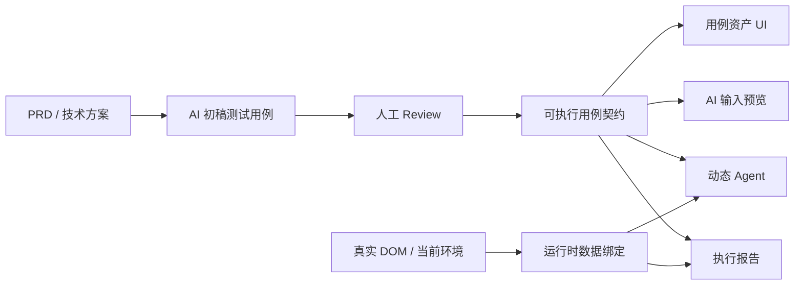
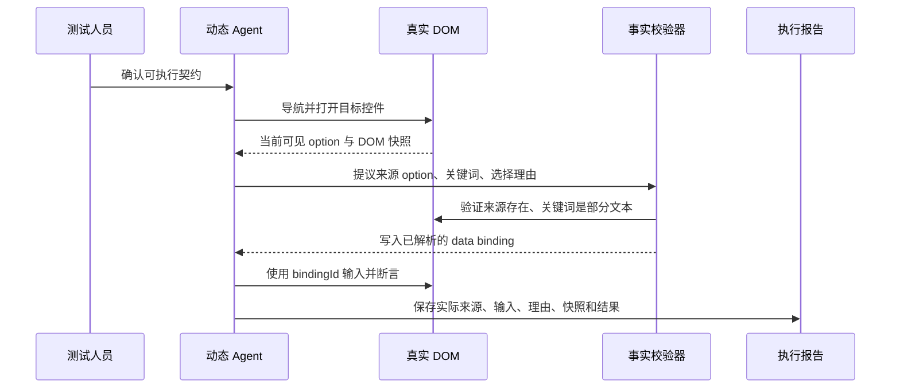

# 统一可执行用例契约与审阅界面设计

**日期：** 2026-09-02  
**状态：** 已完成方案确认，待评审实现计划  
**实现分支：** `codex/test-case-contract`  
**核心界面：** 用例资产采用「左侧用例 + 右侧完整审阅」布局。

## 1. 要解决的实际问题

当前平台已经能从 PRD、技术方案生成测试用例，也能由动态 Agent 操作真实 Playwright 页面；但“给人看的用例”和“实际发给 Agent 的执行目标”不是同一层数据。

具体表现为：

- 用例列表主要只展示标题、类型、优先级和状态；前置条件、步骤、预期结果没有在主审阅界面完整呈现。
- `server/agent-goal.ts` 会把前置条件、步骤、预期结果和人工 Review 文本拼接为 `objective`，Agent 能看到的业务内容比用户在列表看到的更多。
- PRD 没有提供具体测试数据时，生成阶段可能把示例性文本误当作固定数据。例如“模考数学一”并不存在于当前账号的真实下拉选项中，动态 Agent 仍会忠实输入它并执行断言。
- 多条已选用例被拼进同一个 Agent 目标，执行中心难以说明当前属于哪条用例、实际使用了什么数据、失败是环境前置问题还是产品问题。

本设计的目标不是把模型限制成“只能选第一条 option”，而是建立可追溯的边界：**AI 负责基于真实候选数据做业务判断；系统只验证该判断有没有事实依据。**

## 2. 成功标准与非目标

### 成功标准

1. 同一条业务用例在 UI、Agent 输入预览、动态执行和报告中使用同一份可执行契约。
2. 用户可以在执行前完整查看和修改：目标、前置条件、操作、数据策略、断言与人工最终口径。
3. 模糊搜索等数据依赖场景能从当前页面真实 DOM 中选择数据；AI 不再凭空生成不存在的业务值。
4. 执行报告能回答：执行了哪条用例、AI 选择了哪个来源选项、实际输入了什么、为何这样选、依据了哪个 DOM 快照。
5. “环境没有可用测试数据”和“产品行为不符合预期”在状态和报告中明确区分。

### 本次不做

- 敏感信息检测与脱敏；
- 多 Agent 协同；
- 跨项目 Manifest 发布；
- 自动拉取远端仓库、自动切换用户原项目分支；
- 变更回归（ChangeSet / Diff）功能。该功能继续在独立分支 `codex/change-regression` 设计和实现。

## 3. 核心决定：一个契约，四个视图

系统不再分别维护“列表摘要”“Agent 拼接文本”“运行时隐式数据”三套事实，而是为每条用例生成一个 **可执行用例契约**（Case Execution Contract）。



“一个契约”不代表 UI 必须展示 JSON。UI 默认使用易读字段展示；“查看 AI 接收内容”则用同一对象生成完整预览。两者只是在展示层不同，业务内容不得不同。

每一次执行都记录契约版本标识（`contractFingerprint`）。报告中的标识、Agent 输入预览和人工确认的版本必须一致，避免执行了修改前的内容却在页面看修改后的内容。

## 4. 契约数据模型

现有 `PrdAnalysis.requirements[].testCases[]` 保留为 AI 从文档得到的原始建议。人工修改和可执行化结果存入 `ReviewState.caseReviews`，与现有 `questionReviews` 保持一致的覆盖式结构，避免篡改原始 PRD 分析结果。

概念模型如下（字段命名在实现时可按既有代码风格调整）：

```ts
type TestDataSourceMode = 'runtime_dom' | 'fixture' | 'manual'

interface TestDataBinding {
  id: string
  label: string
  mode: TestDataSourceMode
  targetHint: string
  businessIntent: string
  strategy?: 'visible_option_substring'
  constraints: {
    mustComeFromCurrentDom: boolean
    mustBePartialOfSource?: boolean
    mustRemainAfterFiltering?: boolean
  }
  fixture?: {
    value: string
    evidence: string
  }
}

interface CaseExecutionContract {
  objective: string
  preconditions: string[]
  steps: string[]
  expectedAssertions: string[]
  dataBindings: TestDataBinding[]
  forbiddenBehaviors: string[]
  uncertainties: string[]
}

interface CaseReview {
  status: 'draft' | 'confirmed' | 'needs_data_review'
  finalContract: CaseExecutionContract
  updatedAt: string | null
}
```

服务端提供一个纯函数 `resolveCaseExecutionContract(analysis, caseKey)`：它合并原始用例、关联的已确认问题 Review、该用例人工 Review，返回 UI 和 Agent 共用的最终对象。前端不得自行拼接一套“展示用文本”；Agent 也不得再从零散字段自行拼接一套不同的业务描述。

## 5. 数据策略：保留 AI 判断，校验事实依据

### 5.1 三种数据来源

| 模式 | 适用场景 | 可执行条件 |
| --- | --- | --- |
| `runtime_dom` | 当前账号、当前页面数据会变化，如考试下拉、学生列表、订单列表 | 真实 DOM 已展示可用候选数据 |
| `fixture` | 文档或环境协议明确要求存在固定值 | 固定值与来源证据均已保存 |
| `manual` | 人工本次明确指定值 | 人工在本次 Review 中填写并确认 |

没有证据的具体文案不能默认为 `fixture`。例如“模考数学一”若没有来自需求文档、测试数据协议或环境说明的证据，就标记为 `needs_data_review`，不能悄悄当作合法固定数据继续执行。

### 5.2 TC-003 的正确表达

“按部分关键词搜索并高亮匹配文本”应保存为：

```text
目标：验证选择考试支持部分关键词筛选与高亮。
数据模式：runtime_dom。
来源：当前打开的“选择考试”下拉框中的可见 option。
策略：从某个真实 option 名称中选择适合业务语义的非空子串。
约束：该子串必须严格短于来源 option；输入后来源 option 仍应处于筛选结果中。
断言：筛选结果存在；匹配文本的高亮以实际组件可观察 DOM 证据验证。
```

AI 可在真实候选项中选择“数学”或另一个更具代表性的部分关键词，并给出理由；系统不规定它必须选择哪一个候选项，也不把“数学”写死在用例中。

### 5.3 运行时绑定流程



动态 Agent 新增一个内部决策阶段 `resolve_test_data`，它不是 Playwright 动作：

- Agent 输出 `bindingId`、来源元素/文本、实际值与理由；
- 校验器从当前快照验证来源文本可见、关键词确为其子串、关键词不是完整 option；
- 通过后才把值写为已解析数据；后续 `fill` 使用 `valueRef` 引用该 binding，而不是模型直接携带任意文字；
- 若当前页面没有安全候选项，返回 `blocked`，原因是“当前环境不满足数据前置条件”，不制造假数据。

这个机制是通用能力：不同组件只通过 `TestDataBinding` 的业务意图和约束表达差异，模型策略不需要为“考试”“学生”“课程”等业务名词分别硬编码。

## 6. 人工 Review 与最终执行口径

右侧详情默认展示“执行契约”，而不是只展示标题或摘要。字段按人类审阅顺序组织：

1. 用例目标；
2. 前置条件；
3. 操作步骤；
4. 运行时数据策略或固定数据来源；
5. 预期断言；
6. 关联的人工最终口径、禁止行为、不确定项。

`编辑`进入同页编辑态，用户可修改文字、把数据策略从固定值改成运行时取值、补充固定夹具证据，或把用例标记为暂不执行。保存后状态为 `draft`；点击“确认可执行”才变为 `confirmed`。

“查看 AI 接收内容”是常驻的次级入口，不是一次性弹窗。它显示：

- 该用例的最终契约；
- 关联的已确认问题 Review；
- 当前环境与目标地址；
- 已解析运行时数据（如尚未预检则明确显示“执行时解析”）；
- 不展示给用户也不属于业务口径的框架级安全规则可归入“系统执行规则”区，但不得混淆为测试用例内容。

人工最终口径继续沿用已有 Question Review 体系；Case Review 只负责用例自身的测试数据、步骤和断言。`resolveCaseExecutionContract` 将两者合并，避免一份口径在问题中心、用例资产、Agent 目标中各自复制。

## 7. B 布局的交互设计

桌面端用例资产采用主从布局，而非列表内无限展开或右侧临时抽屉。

```text
┌───────────────用例列表（约 1/3）──────────────┬────────执行契约详情（约 2/3）────────┐
│ 已选 3 / 8 · 已确认 6                         │ TC-003 按部分关键词搜索并高亮匹配文本      │
│ ☑ TC-001 首次点击选择考试        可执行       │ [编辑] [预览本次运行数据] [确认可执行]     │
│ ☑ TC-002 按完整名称搜索          待数据确认   │                                                │
│ ☑ TC-003 按部分关键词搜索        可执行       │ 目标 / 前置条件 / 步骤 / 数据策略 / 断言    │
│   TC-004 连续修改关键词          草稿         │ 查看 AI 接收内容 / 最近一次执行结果          │
└───────────────────────────────────────────────┴────────────────────────────────────────────────┘
```

规则如下：

- 点击行：只切换右侧正在审阅的用例；复选框：只控制是否纳入本次执行。这两个概念不混用。
- 左侧每行展示用例编号、短标题、数据策略状态、Review 状态；完整正文只在右侧显示。
- 右侧默认直接显示所有核心业务字段，避免把关键信息藏在“展开详情”或深层 tab 中。
- `预览本次运行数据`会在已配置环境下打开真实页面并解析候选数据；用户能接受、修改或拒绝 AI 提议。
- 执行按钮缺少条件时保持可见但禁用，并在旁边明确说明缺少的条件和对应修复入口。
- 窄屏不使用多层折叠卡；切换为“用例列表页 → 用例详情页”，详情页提供清晰的返回入口。

## 8. 执行与报告边界

### 8.1 用例是验证边界，批次会话才是页面边界

批量选择仍然允许，但运行器不再将所有选择项拼成无法辨认的一大段 `objective`，也不再为每条用例强制重开页面。一个批次是一段连续的真实业务操作流；选中的用例按顺序成为其中的 case checkpoint：

- 整个批次使用同一个 BrowserContext、storageState 和 Page，保留当前登录态、页面状态和已完成操作；
- 每条用例仍有独立的契约、解析数据、断言、轨迹片段和结果，因此报告能明确归因；
- Agent 每次切换到下一条用例时，会收到当前用例、已结束用例的简要结果和当前真实 DOM，可自行判断继续当前操作、复用已打开的控件、补做恢复操作或导航到合适页面；
- 不强制从目标 URL 重置，也不假设前序用例留下的状态一定正确，所有继续动作都要基于当前 DOM 决策；
- 当前用例失败、受阻或用完其步骤预算时，只结束并记录该 case checkpoint，随后进入下一条；普通业务失败不停止整批；
- 只有浏览器崩溃、认证/登录态整体失效、测试网络不可用等会话级基础设施故障，才停止整批执行。

这同样不重置后端业务数据。连续性是刻意保留的业务上下文，而不是依赖偶然残留：报告会标注某条用例是否复用了前序页面状态与其起点 DOM 快照。

### 8.2 固定计划兼容规则

固定计划只能使用已确定的数据：

- `fixture` 与 `manual` 数据可直接生成计划，并在同一批次会话中按选中顺序连续执行；
- `runtime_dom` 数据需先完成一次预检，保存来源 option、实际值与快照时间后才能生成固定计划；
- 未解析的运行时数据不生成含假值的固定计划，页面说明原因并引导预检或改用动态 Agent。

### 8.3 报告内容

每个 case result 至少保存：

- `caseKey`、标题、契约版本标识；
- 最终使用的数据绑定：来源 option、实际输入、选择理由、DOM 快照标识；
- 通过/失败/受阻状态；
- 已通过与未通过断言；
- trace、截图、源码项目与分支信息（若本次读取了源码）。

批次报告还保存用例顺序、每条开始时的页面地址和 DOM 快照，以及“继续前序会话 / Agent 主动恢复页面”的说明，方便开发人员理解相关用例之间的关系。

实时执行面板同步改为保留有序活动历史，运行中步骤完成后不消失；用户可滚动查看。当前操作始终带 `TC-xxx` 与可读用例标题，技术动作如 `click e10` 作为辅助信息保留，不取代业务说明。

## 9. 错误分类与可读提示

| 情况 | 结果状态 | 给用户的说明 |
| --- | --- | --- |
| 契约中固定值没有来源证据 | 待数据确认 | 请选择改为运行时数据、补充夹具来源，或暂不执行 |
| 当前 DOM 没有可用候选项 | 受阻 | 当前账号或环境不满足测试数据前置条件，不判为产品失败 |
| AI 提议的数据与当前 DOM 不一致 | 受阻 | Agent 的数据提议没有事实依据，未对页面执行输入 |
| 输入真实候选子串后没有保留匹配项 | 失败 | 产品筛选行为不符合已确认契约 |
| 高亮不能从组件 DOM 中得到可验证证据 | 受阻或待确认 | 需要补充可观察高亮规则，不能用“列表有文字”冒充高亮通过 |
| Playwright、登录态或网络异常 | 基础设施失败 | 显示可重试动作，并与业务失败区分 |

除最后一行的会话级基础设施失败外，上述每一种结果只结束当前用例，运行器必须记录后继续处理下一条已选用例。

## 10. 旧数据迁移策略

不静默修改既有分析和用例。

- 已保存的用例继续可查看，解析为兼容的原始契约；
- 没有具体测试数据的旧用例可以按原逻辑继续执行；
- 包含具体业务值、但来源无法证明的旧用例进入 `needs_data_review`，在左侧和右侧明确标记；
- 人工可将它转为 `runtime_dom`，或补充 `fixture.value` 与 `fixture.evidence`；
- 报告保留旧执行记录，不以新契约覆盖历史事实。

## 11. 实现边界与主要改动点

| 层级 | 主要变化 |
| --- | --- |
| `shared/contracts.ts` | 新增 Case Review、Case Execution Contract、Data Binding、case result 与 `resolve_test_data` / `valueRef` 协议 |
| `shared/review-state.ts` | 扩展 Case Review 的就绪判断，保留现有 Question Review 语义 |
| `server/model.ts` | 生成用例时区分固定夹具与运行时数据；无证据时不得编造具体业务值 |
| `server/agent-goal.ts` | 从解析后的单条契约构造结构化 Agent 目标，不再仅拼接大段字符串 |
| `server/responses-decision-provider.ts` | 让模型输出运行时数据提议；禁止未经解析直接给 runtime binding 填任意字面量 |
| `server/test-agent.ts` / `server/test-policy.ts` | 校验并保存数据绑定；按 case scope 执行并维护断言边界 |
| `server/single-action-executor.ts` | 支持 `valueRef`，并为高亮类断言提供可观察 DOM 证据路径 |
| `server/index.ts` / 持久化层 | 保存 Case Review、预检结果与 case-level execution result，兼容旧分析记录 |
| `src/App.vue` | 用例资产改为 B 布局、同页编辑、AI 输入预览、预检、清晰执行前置提示和可读活动历史 |

## 12. 验证策略

实施前先补测试，再改生产代码。至少覆盖：

1. 契约解析：运行时数据、固定夹具、人工值与旧用例兼容；
2. PRD 生成：没有证据的示例数据不能生成合法 `fixture`；
3. 数据绑定校验：来源 option 不在当前 DOM、关键词等于完整名称、筛选后来源消失均不能继续执行；
4. Agent 目标：UI 预览和 Agent 使用同一契约版本、同一字段；
5. 批量执行：同一会话内每条 case 有独立结果、已解析数据与失败归属；一条业务失败后下一条仍可根据当前 DOM 继续；
6. UI：点击行与复选框语义分离，未确认用例不能进入执行，预览与编辑内容可重新打开；
7. 回归：既有 Question Review、固定计划、storageState、软链源码 Provider 和实时画面流仍可用；
8. 最终检查：相关 Node 测试、类型检查/构建、真实测试环境的一个 runtime_dom 场景。

## 13. 交付顺序

1. 契约与 Review 数据模型、旧记录兼容；
2. 运行时数据提议与事实校验；
3. 单 case scope、报告与实时活动历史；
4. B 布局与人类可读审阅/编辑/预检界面；
5. 固定计划与真实环境回归验证。

这个顺序先让“执行什么”可验证，再改善“如何看见和修改”，避免 UI 已经展示新字段但执行器仍在使用旧拼接字符串。
