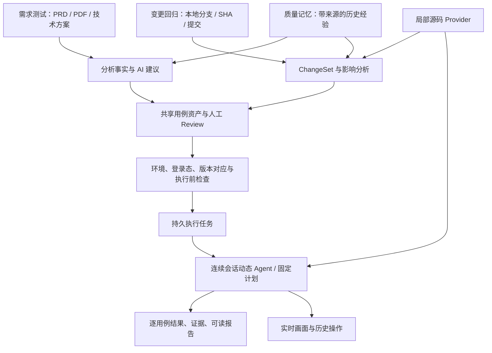

# 产品架构与交互设计

## 1. 核心目标与适用场景

服务前端开发人员和参与验收的测试/产品人员：让开发者在缺少专门回归时间时，将需求或代码变更转成可审核的验证范围，在真实 B 端页面执行，并拿到可以定位问题的证据。

第一条场景：新功能完成，上传 PRD 或技术方案，明确歧义，审核用例，配置环境，执行并交付报告。

第二条场景：改造一个表格组件、筛选器或业务流程，选择本地分支和比较范围，分析影响页面与共享调用方，确认回归用例，在已部署的测试环境回归。

“完整”指每条选中用例最终有明确的通过、失败、受阻、取消或未执行结论，有数据依据和可访问的报告。它不等于任意业务都能无人值守通过，也不等于代码 Diff 能证明全部业务正确。

## 2. 总体结构



## 3. 仓库与模块边界

```text
quality-ai/
├── web/
│   ├── src/
│   │   ├── app/                 # 路由、布局、导航
│   │   ├── features/
│   │   │   ├── requirements/    # 需求任务、文档与分析
│   │   │   ├── regressions/     # 变更范围、风险与回归任务
│   │   │   ├── cases/           # 主从列表、详情、审核编辑
│   │   │   ├── executions/      # 执行配置、过程、报告
│   │   │   ├── projects/        # 项目、环境、登录态
│   │   │   └── memories/        # 历史经验及来源
│   │   └── shared/             # API 客户端、展示组件、样式
│   └── package.json
├── api/
│   ├── src/
│   │   ├── app.ts              # HTTP 服务组合
│   │   ├── index.ts            # 启动与关闭
│   │   ├── config/             # 路径、环境变量
│   │   ├── modules/            # requirements / cases / executions / regressions / projects / memories
│   │   ├── automation/         # observer、policy、executor、Agent、runners
│   │   ├── integrations/       # model、project-knowledge、git
│   │   └── storage/            # 数据库连接、迁移
│   └── package.json
├── packages/contracts/src/     # 按领域拆分类型与 Zod schema
├── docs/
├── package.json
└── pnpm-workspace.yaml
```

依赖方向：web → contracts；api → contracts；web 不导入 api；contracts 不导入 Node、Vue、数据库或 Playwright。共享 UI 文案和 reducer 放 web，服务端业务 resolver 放 api；不要把现有 shared 目录原封不动升级为公共包。

后端按业务模块聚合 route/service/repository：只有实际存在存储或复杂流程时才拆对应文件。先保留 Node HTTP、SQLite 和现有 Provider，不在本轮顺便更换 Web 框架、ORM 或引入微服务。

前端页面负责装配，业务组件负责局部操作，composable 管理与该流程关联的状态。服务端记录通过 API 读取；草稿属于编辑器；筛选和选中项放 URL；临时弹窗状态留组件。避免建立一个容纳所有业务的大 store。

数据库、artifact、auth、项目配置使用显式配置根路径，不能随启动 cwd 改变。迁移 monorepo 必须保持旧数据可读、旧产物链接可用。原有 build/worker/Sites 部署适配需单独登记和兼容，不允许因目录迁移静默删除。

## 4. 信息架构与路径

侧栏：需求测试、变更回归、用例资产、执行中心、项目与环境、质量记忆。版本作为任务筛选和元数据保留，避免用户在“版本”和“需求”之间反复切换找入口。

| 页面 | URL 设计 | 默认内容及下一步 |
|---|---|---|
| 需求任务列表/详情 | `/requirements`、`/requirements/:id` | 材料、分析、待确认事项；进入用例审核 |
| 回归列表/详情 | `/regressions`、`/regressions/:id` | 范围事实、风险、人工范围；进入回归用例 |
| 用例资产 | `/cases?sourceType=&sourceId=&caseId=` | 左列表右详情，URL 恢复选中项 |
| 执行列表/详情 | `/executions`、`/executions/:id` | 运行中看过程，结束后看报告，同一地址 |
| 项目与环境 | `/projects/:id?tab=environments` | 源码连接、环境、登录态状态 |
| 质量记忆 | `/memories` | 经验、原始执行来源、适用范围、失效状态 |

任务顶栏持续显示项目、任务名称和版本；执行页额外显示测试地址、源码 SHA、部署版本确认状态。列表保留筛选与位置；“返回任务”“返回执行列表”等文案明确目的地。直接打开详情也有稳定返回入口。

## 5. 用例审核工作台

```text
项目 / 任务名称                       [使用指引] [配置并执行 8 条]
状态筛选、关键词、风险筛选
┌ 用例列表约 30% ───────┬ 用例详情约 70% ─────────────────┐
│ □ TC-001 完整标题     │ TC-003 部分关键词搜索           │
│ □ TC-002 完整标题     │ [执行内容] [AI 原始建议] [历史]  │
│ ☑ TC-003 当前选中     │ 目标 / 前置条件 / 操作 / 断言    │
│ 状态、就绪原因        │ 数据来源 / 禁止行为 / 不确定项    │
│                      │ [编辑] [保存草稿] [确认执行口径]  │
└──────────────────────┴────────────────────────────────┘
```

点击行切换详情，复选框只选择执行集合；两者事件不能相互触发。默认展示服务端解析后的完整执行契约。AI 建议只读，人工编辑保存覆盖层，历史执行保留当时契约快照与指纹。

数据来源用中文解释：从当前页面选取、使用指定测试数据、人工指定。动态取值展示选取规则，不提前伪造值。完整名称搜索允许完整 option；部分搜索使用非空严格子串；无匹配搜索允许构造不存在值但必须明确属于负例。不能把“所有搜索都必须匹配”变成通用限制。

人工描述简略时可点击“AI 整理为执行方案”，显示差异和未确定项，人工接受后才更新最终契约。AI 可以辅助细化，不能静默覆盖人工决定。

## 6. 执行、实时画面与报告

启动后立即得到 executionId。执行任务由服务端持有；浏览器关闭面板、切页、断流不会取消测试。刷新页面能查询状态并补取历史事件；服务端重启后将失去运行上下文的任务标为基础设施中断，不显示假运行中。

执行页布局：主要区域是用例进度与操作历史，右侧为可调整宽度的 Playwright 实时画面。窄屏切换“操作 / 画面”标签。画面可放大；帧注明时间，断流显示“预览断开，执行状态正在查询”。

每一步显示“TC 编号＋用例标题、业务目的、动作结果”，技术信息可展开，继续保留 `click e10`。历史追加，同一动作的开始与结束更新同条记录；用户滚动查看历史时暂停跟随，提供“回到最新”。

报告先展示选中数量、通过、失败、受阻、取消、未执行；操作成功数不能冒充用例通过数。默认分别展示“通过数/选中总数”和“已完成验证通过率”，后者只以 passed+failed 为分母并标注口径。基础设施中断后剩余用例显示未执行及原因。

用例详情：测试目标 → 实际操作与输入 → 预期与实际 → 数据来源/DOM → 源码参考 → 截图/下载/Trace。断言失败先称“验证失败”，区分产品差异、定位/执行错误、环境故障、未知；不能仅因超时直接认定产品 bug。

产物通过 artifact ID 获取，支持每条用例的子目录；文件路径不直接作为客户端访问权限。Trace 提供下载和明确的本地查看说明；Markdown 报告可导出，引用关联证据，不能在导出里嵌入登录态。

## 7. 重构回归的事实与推断


范围模式：

- 端点比较（默认）：上次部署 SHA 到目标 SHA 的最终树差异，适合“测试环境升级了什么”。无记录时用户明确选择基线，不能擅自猜主干。
- 分支贡献：merge-base 到目标 SHA，适合“当前分支改了什么”；UI 解释与端点比较的区别。
- 指定提交：查看选中的若干提交各自 patch，并列出父提交和顺序。三个不连续提交不能伪装成一个连续范围；提示目标版本还有未选中的变更。合并提交第一版要求明确选择父提交，否则提示改用端点比较。

分支名在创建时解析为 SHA 并保存，后续分支移动不改历史。默认不包含未提交内容；显示 dirty 提示。基础事实用 Git 读取；AI 输出风险是建议，须带文件与位置依据、关联页面、置信度和遗漏范围。

共享组件变更需要查调用方，删除/重命名需同时读取旧树和新树，动态路由/运行时依赖找不到时标记分析不完整。大型 Diff 按模块分段并展示未分析范围，禁止截断后声称全部覆盖。

回归报告可以说“本次比较范围内验证失败，关联这些变更”；没有旧版本对照或二分证据，不能说“已确定由某个 commit 引入”。

## 8. 统一交互准则与验收

- 正文默认 16px，辅助正文至少 14px；状态不能只靠颜色；键盘可聚焦，错误与输入关联。
- 内容区弹性占满可用空间，1440px 桌面边距约 24px，避免固定窄容器；长标题换行、详情可展开。
- 每个侧栏页面有“使用指引”：说明用途、所需输入、操作顺序、结果去向，可重复打开。
- 关键按钮旁显示缺少的条件和跳转入口，不能只对 disabled 按钮设置 tooltip。
- 保存成功轻量通知约 5 秒可关闭；失败及受阻内联保留，支持复制错误与重试。长任务展示阶段、最近更新时间和取消入口。
- 保存中禁止重复提交，保存失败保留草稿；离开有修改的编辑器时提供保存/放弃/留在当前页。
- 运行状态与预览连接状态分开；关闭预览与取消执行使用不同按钮。
- 历史报告只读；重跑创建新执行并关联原执行，不能覆盖原结果。
- 质量记忆只作为提示：显示适用项目、版本、来源证据，标记采纳/失效，不绕过当前 DOM 验证。

最终验收以两个故事进行：①上传技术方案并修改一条用例后执行，制造一次失败确认后续仍运行，关闭/刷新后找到报告；②选择本地重构分支的三个提交，检查共享组件影响、人工缩减范围，在已部署环境回归并追溯到范围快照。
