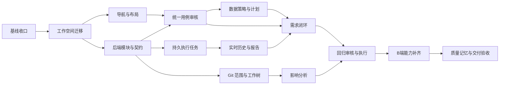

# 可视化 B 端测试与变更回归 Implementation Plan

> 排期更新（2026-10-03）：本文件作为任务细节库，执行顺序以 [03-Goal总计划与验收标准](./03-Goal总计划与验收标准.md) 为准。T00 的整合工作已由 `99eee49` 完成，执行前只核对；不要再次合并工作区或重做已有功能。新增用例质量专项见 04。

**Goal:** 在可维护的 monorepo 中交付需求测试与本地代码变更回归两条可视化闭环。

**Architecture:** 根目录 web/api 工作空间共享 contracts；两种业务来源复用用例审核、持久执行任务、Playwright 与报告。连续浏览器会话保留独立用例证据。

**Tech Stack:** 沿用 Vue 3、TypeScript、Vite、Node HTTP、SQLite、Zod、Playwright；新增 pnpm workspace 与 Vue Router，具体版本由锁文件固定。

**Spec:** [产品架构与交互设计](./01-产品架构与交互设计.md)。执行者必须同时阅读 [交接规则](./00-阅读入口与交接规则.md)。无需安装特定 IDE 插件或使用多 Agent。

## 全局约束

- 只实施指定任务；需求与变更回归不得互相伪装数据来源。
- 不切换或修改被测项目当前工作区，不自动拉远端、不自动部署。
- AI 建议、人工最终口径、运行事实分别保存；历史不可被当前编辑覆盖。
- 以同一服务端契约驱动审核与执行；源码是辅助证据，最终通过需运行证据。
- 维持连续会话、普通失败继续；未执行与受阻分别表达。
- 不实现敏感信息检测与脱敏、多 Agent、跨项目 Manifest 发布。
- 每项完成记录 SHA、验证结果与遗留项；遵循用户偏好，不默认执行全仓库严格回归。
- 本文新增接口是目标约定，不代表当前已存在。迁移后的路径同样是拟创建路径。

## 排期与依赖



默认串行交给 IDE，每项可以按下面子步骤拆成独立提交。第一里程碑 T00–T03：结构和导航可用；第二里程碑 T04–T08：需求测试可完整交付；第三里程碑 T09–T11：变更回归闭环；第四里程碑 T12–T13：扩展 B 端能力与交付。

## 共享数据和接口约定

先复用现有 CaseExecutionContract、ResolvedCaseExecutionContract、ResolvedDataBinding；不要重新发明第二套同义类型。T03 增加来源和稳定 ID 外层：

```ts
type CaseSource =
  | { type: 'requirement'; analysisId: string; caseKey: string }
  | { type: 'change_regression'; regressionId: string; suggestionId: string }

interface CaseAsset {
  id: string
  title: string
  source: CaseSource
  revision: number
  reviewStatus: 'draft' | 'confirmed' | 'needs_data_review'
  // originalSuggestion 保存原始契约；finalContract 保存人工口径。
}

interface ExecutionRequest {
  caseIds: string[]
  expectedFingerprints: Record<string, string>
  environmentId: string
  mode: 'agent' | 'plan'
  projectId?: string
  regressionId?: string
}

type RunState = 'queued' | 'running' | 'completed' | 'cancelled' | 'interrupted'
type CaseOutcome = 'passed' | 'failed' | 'blocked' | 'cancelled' | 'not_run' | 'infrastructure_failed'
// 批次状态与逐用例结果分开。兼容旧 ExecutionStatus，由适配层读取旧报告。

interface ExecutionEventEnvelope {
  executionId: string
  sequence: number
  occurredAt: string
  caseId?: string
  event: LiveExecutionEvent // 引用已有的事件鉴别联合，由 contracts/execution 导出
}

type Comparison =
  | { mode: 'endpoints'; baseSha: string; targetSha: string }
  | { mode: 'merge_base'; baseSha: string; mergeBaseSha: string; targetSha: string }
  | { mode: 'selected_commits'; commitShas: string[]; targetSha: string }

interface ChangeSet {
  id: string
  projectId: string
  targetRef: string
  comparison: Comparison
  createdAt: string
  files: Array<{ path: string; oldPath?: string; status: string }>
  // patch 分段存储并关联文件 ID，详情按需读取。
}

interface DeploymentConfirmation {
  environmentId: string
  targetSha: string
  deployedSha?: string
  state: 'matched' | 'unverified' | 'mismatch'
  evidence: 'manual' | 'environment_metadata'
  note: string
}
```

`expectedFingerprints` 只做乐观并发检查，服务端重新解析契约；不接受客户端上传的执行契约为权威。发现不一致返回 409 并提示重新查看用例。部署 mismatch 阻止以目标版本名义执行，unverified 允许人员记录原因后执行，但报告明确“版本未核实”。

目标接口：

| 接口 | 责任 |
|---|---|
| `GET /api/cases?sourceType=&sourceId=` | 返回任务关联用例 |
| `GET /api/cases/:id/contract` | 完整契约、指纹、就绪原因 |
| `PATCH /api/cases/:id/review` | `{ expectedRevision, review }`，冲突 409 |
| `POST /api/cases/:id/refine` | 返回人工文本细化建议与差异，不自动保存确认 |
| `POST /api/cases/:id/preflight` | 输入环境和指纹，创建数据预检任务；返回任务 ID |
| `POST /api/executions` | 接受 ExecutionRequest，202 返回 executionId |
| `GET /api/executions/:id` | 持久状态、冻结输入、逐用例结果 |
| `GET /api/executions/:id/events?after=` | 有序补取/订阅事件；沿用 NDJSON |
| `POST /api/executions/:id/cancel` | 请求取消，幂等 |
| `GET /api/artifacts/:id` | 验证归属后读取证据文件 |
| `GET /api/projects/:id/git/refs` | 本机分支及 SHA，不执行 fetch |
| `POST /api/change-sets` | 验证范围并创建不可变 Git 事实 |
| `GET /api/change-sets/:id` | 范围事实与分析覆盖情况 |
| `POST /api/regressions` | 输入 changeSetId，创建分析任务 |
| `GET /api/regressions/:id` | 分析阶段、建议、范围 Review、关联执行 |
| `PATCH /api/regressions/:id/review` | 保存包含/排除项与理由、修订号 |

## T00：确定开发基线并接入已有成果

**依赖：** 无。**产物：** 可追溯的整合分支；不是业务重构。

**文件：** 创建 `docs/后续建设计划/交接记录.md`；按差异涉及旧 `server/`、`shared/`，不覆盖旧 `src/App.vue`。

- [ ] 在三个工作区分别运行 `git status --short --branch`、`git log -5 --oneline`；将实际 SHA、dirty 文件列入交接记录。
- [ ] 审查契约工作区 12 个未提交文件，把已验证的连续执行成果保存为独立 commit；不可把此前助手口头说明当作完成证明。
- [ ] 从主目录当前 HEAD 建 `codex/platform-foundation` 整合分支，比较 merge-base 与两条功能分支历史。接入契约分支所需提交，逐个解决冲突；变更回归分支只接入证实有用的差异。
- [ ] 保留用户分支和未提交内容；路径不在授权写范围时按 IDE 权限处理，不绕过权限。
- [ ] 更新清单：已有、部分实现、缺失。尤其核对契约、runtime_dom、caseResults、源码版本记录和产物 API。

**最小验证：** 类型检查、相关 resolver/runner 测试复用已有结果与必要补测；确认主工作区数据不被改写。提交 `chore: 整合平台建设开发基线`。

## T01：迁移根目录 monorepo 并固定运行路径

**依赖：** T00。**文件：** 根 package/锁文件/workspace、`web/package.json`、`web/vite.config.ts`、`api/package.json`、`packages/contracts/package.json`、`api/src/config/paths.ts`；移动 src/server/shared 内对应文件；迁移 tsconfig/eslint/build 入口。

**输入输出：** 提供 `getRuntimePaths(): { dataRoot, artifactRoot, authRoot, projectConfigPath }`，所有持久目录由统一绝对路径推导。

- [ ] 先记录当前 `data`、config、环境加载位置以及启动端口 4173/8787，避免迁移后生成空数据库误判丢数据。
- [ ] 声明 workspace：`packages: ['web', 'api', 'packages/*']`；包名 `@quality-ai/web`、`@quality-ai/api`、`@quality-ai/contracts`，内部依赖使用 `workspace:*`。
- [ ] 移动前端与服务端，替换跨目录 shared 引用为公共包出口；contracts 先维持兼容出口，由 T03 按领域拆分。
- [ ] 生成 pnpm 锁文件并移除旧 npm 锁文件；固定 packageManager 版本，保留 Node >=22.13.0。迁移时不批量升级现有依赖。
- [ ] 根命令提供 `pnpm dev`、`pnpm build`、`pnpm typecheck`、`pnpm lint`，工作空间提供 `pnpm --filter @quality-ai/api test -- <file>` 对应 Node 测试入口。
- [ ] 明确 API 运行入口使用 tsx 或构建产物，固定一种并写 README；从仓库根和 api 目录启动均读取同一个 dataRoot。调整 Vite proxy、worker/build 引用。

**验收：** 原分析、环境、报告可读；前后端独立启动；contracts 不包含服务端依赖；web 被 lint 覆盖。迁移提交不混入 UI 行为改造。提交 `refactor: 建立前后端工作空间与共享契约包`。

## T02：导航骨架、布局和通用反馈

**依赖：** T01。**文件：** `web/src/app/router.ts`、`AppShell.vue`、`web/src/shared/ui/{PageHeader,InlineNotice,HelpPanel}.vue`、`web/src/shared/styles/tokens.css`、原 App.vue。

- [ ] 安装并固定 Vue Router；实现设计文档的六个入口和详情路径，原有功能先挂到对应页面组件，旧入口做兼容重定向。
- [ ] App.vue 仅保留路由出口和应用级浮层；拆出需求、用例、执行、项目、记忆页面，不在此次重写各页面业务逻辑。
- [ ] 统一 16px 正文、14px 辅助字、弹性内容宽度；实现桌面双栏和窄屏单栏。
- [ ] 筛选与选中记录进入 URL；明确返回目的地。缺失记录显示“记录不存在/返回列表”，不要白屏。
- [ ] 通知区区分瞬时成功和持久错误；每页提供可重复打开的使用指引。

**验收：** 直接访问详情、刷新、浏览器后退均正确；1440px/1920px/窄屏检查无大片无意义留白和横向遮挡；不丢失现有操作。提交 `refactor: 建立可恢复导航和统一页面布局`。

## T03：拆分后端模块与统一用例资产

**依赖：** T01。**文件：** `api/src/app.ts`、`modules/{requirements,cases,executions,projects}/`、`storage/{database,migrations}.ts`、`packages/contracts/src/{cases,execution,requirements,projects,index}.ts`。

- [ ] 从旧 index 按路由组提取 handlers，保留现有状态码及响应；从 database 按真实存储职责拆 repository，共用连接与事务，不增加纯转发 service。
- [ ] 将模型和源码 Provider 移到 integrations、执行模块移到 automation，更新测试路径。
- [ ] 增加稳定 CaseAsset ID、来源、revision 与人工 Review；旧 analysisId+caseKey 建唯一映射，重复读取不重复创建资产。
- [ ] 提供统一契约读取与 Review API；复用旧 resolver，回归来源通过独立解析适配进入相同输出结构。
- [ ] 保存执行时契约快照与指纹；PATCH expectedRevision 不符返回 409，保留用户草稿。

**最小验证：** 临时数据库验证旧数据无损迁移、重复映射幂等、过期编辑拒绝；相关路由冒烟。提交可分为 `refactor: 拆分后端业务模块`、`feat: 统一用例资产与版本化审核`。

## T04：主从用例审核与人工最终口径

**依赖：** T02、T03。**文件：** `web/src/features/cases/{CasesPage,CaseList,CaseDetails,CaseReviewEditor,DataBindingEditor}.vue`、`useCaseReview.ts`、`api/src/modules/cases/refine.ts`、共享 API client。

- [ ] 列表行与复选框分离；实现标题/状态/来源筛选和右侧固定详情。
- [ ] 默认读取完整 resolved contract；提供执行内容、AI 原始建议、历史三页签。
- [ ] 编辑目标、前置条件、步骤、断言、数据来源、不确定项；保存草稿和确认执行口径为两个动作，校验失败原位提示。
- [ ] AI 整理人工口径返回差异与未确定项，用户逐项或整体接受后才写 finalContract。
- [ ] 请求竞态只应用最新 caseId 的响应；网络失败保留草稿；切换/离开未保存编辑时提示。

**验收：** 改写搜索用例后 UI、契约 API 和执行输入一致；选用例不改变详情编辑；未确认原因可见。仅做类型/构建与上述交互检查。提交 `feat: 完整用例审核工作台`。

## T05：模型数据策略、固定计划和预检闭环

**依赖：** T03、T04。**文件：** `api/src/modules/cases/{preflight,plan-generation}.ts`、`api/src/automation/{test-data-binding,test-policy,test-agent}.ts`、`api/src/integrations/model/`、`packages/contracts/src/cases.ts`、`web/src/features/cases/BindingPreview.vue`。

**重点缺口：** 已有 adapter 即使解析了 finalContract，仍可能把原始 testCase 传给模型。此项必须检查生成器实参和提示词，不能只检查响应携带 fingerprint。

- [ ] 分析产物区分示例文字与真实夹具；未给来源的固定值进入待确认状态。
- [ ] 扩展明确的数据策略：完整 option、严格子串、负例搜索词；AI 可选择候选和操作顺序，策略只校验当前用例的语义边界。
- [ ] 模型生成器只接收 resolved contract 和已核验环境绑定；单测断言人工修改后的步骤/值确实进入模型请求，原始示例没有覆盖它。
- [ ] 预检独立任务返回 sourceText/value/snapshotId/observedAt/environmentId/targetUrl/fingerprint；预览不永久改变业务口径。
- [ ] runtime 固定计划执行时重新验证绑定仍适用；契约、环境或目标变化立即失效。旧绑定不能直接成为新浏览器中的事实，不确定则重新预检或建议动态 Agent。
- [ ] 固定计划详情完整展示全部 casePlans；不得只显示兼容字段 plan.steps 的第一条用例。

**最小验证：** 三种搜索策略、无候选受阻、预检失效、人工契约覆盖原始用例、完整 casePlans 展示。提交 `feat: 统一计划生成与真实环境数据策略`。

## T06：持久执行任务、补取事件和取消

**依赖：** T03。**文件：** `api/src/modules/executions/{routes,service,repository,events}.ts`、`api/src/automation/*runner.ts`、`packages/contracts/src/execution.ts`。

- [ ] POST 创建 queued 记录并立即 202 返回 executionId，再由进程内调度器执行；第一版默认单个活跃浏览器任务，其他排队，前端明确显示。
- [ ] 输入冻结 case 契约、顺序、环境和源码版本；验证指纹不一致返回 409。重复点击用 requestId 防重复任务。
- [ ] 业务事件按 executionId+sequence 唯一持久化，允许 after 补取；高频画面仅保留最新帧，不把每帧写入数据库。
- [ ] 保留已有连续 Page 行为，每条用例重新验证自己的断言/数据；前序摘要只作背景。
- [ ] 浏览器丢失/服务端重启明确 interrupted，剩余用例 not_run；取消使活跃用例 cancelled、后续 not_run，已经完成的结果不改写。
- [ ] 使用 AbortSignal 贯穿模型与动作边界；当前不可中断动作有明确超时，到安全点停止，取消重复调用幂等。
- [ ] 旧同步/stream 接口保留兼容适配并注明迁移，不让旧客户端误把流断开当完成。

**最小验证：** 断开 HTTP 客户端不取消任务；重新查询可补事件；失败后继续；取消和重启状态归属。提交 `feat: 可恢复的持久执行任务`。

## T07：实时执行历史、证据访问和可读报告

**依赖：** T02、T06。**文件：** `web/src/features/executions/{ExecutionPage,LivePreview,ActivityHistory,CaseResult,ReportSummary}.vue`、`useExecution.ts`、`api/src/modules/executions/{artifacts,report-export}.ts`。

- [ ] 对事件按 sequence 去重、按 activity id 更新；历史不因当前操作变化而消失。
- [ ] 主区展示业务操作、用例标题与完整历史，右侧画面流；滚动历史时暂停跟随，显式恢复。
- [ ] 关闭面板后执行中心可再次进入；查看完整报告跳转同一 executionId，运行中也有过程详情。
- [ ] 结果按每条用例展示实际输入、数据来源、断言、截图、Trace，单独展示未执行；统一统计口径。
- [ ] artifact 注册唯一 ID 与执行/用例归属，兼容旧根目录文件及新用例子目录；拒绝路径穿越和跨任务引用。
- [ ] 导出中文 Markdown 摘要和失败详情，附证据入口；旧报告缺少字段显示“历史记录未采集”，不能补造事实。

**验收：** 快速步骤历史全部可看、滚动不抢位置、刷新能恢复、子目录 Trace 可下载、重跑不覆盖旧报告。提交 `feat: 可回看的实时过程与逐用例报告`。

## T08：串起需求测试的完整使用流程

**依赖：** T04、T05、T07。**文件：** `web/src/features/requirements/{RequirementsPage,RequirementTaskPage,DocumentImport,QuestionReview}.vue`、`features/executions/ExecutionSetup.vue`、对应 requirements API。

- [ ] 导入支持一份/多份 Markdown/PDF/技术方案；材料角色由用户确认，错误定位到具体文件。
- [ ] 分析显示真实阶段、最近响应时间和可重试原因；文档解析失败不丢材料选择。
- [ ] 待确认问题保留 AI 建议与人工最终口径；修改关联问题后标记受影响用例需要复核。
- [ ] 执行前核对选中完整用例、环境、登录态、源码项目与可执行原因；按钮旁有直接修复入口。
- [ ] 从任务详情可访问该任务所有执行，完成报告能返回原任务和用例。

**验收故事：** 上传技术方案 → 人工改一条搜索用例 → 动态运行 → 一条失败后继续 → 关闭并刷新 → 找到同一报告与证据。提交 `feat: 打通需求测试可视化闭环`。

## T09：本地 Git 范围事实与受管理 worktree

**依赖：** T03。**文件：** `api/src/integrations/git/{local-git,worktree-manager}.ts`、`api/src/modules/regressions/change-sets.ts`、`packages/contracts/src/regressions.ts`。

- [ ] 使用 execFile 参数数组读取 Git，不拼 shell 命令；本地 ref 解析为 SHA，未知 ref 返回可读错误。
- [ ] 支持 endpoints、merge_base、selected_commits；先展示范围预览再固定事实，保存提交清单和文件变化。
- [ ] 验证 selected_commits 可达 targetSha；列出未选中但包含在目标版本的变更；合并提交无父选择时拒绝该模式。
- [ ] 支持重命名、删除、二进制文件和空 Diff。空 Diff 给出“无可分析变更”，不调用模型虚构风险。
- [ ] 对目标 SHA 创建平台管理目录下 detached worktree，记录 ownership/引用计数；已有 dirty 源码工作区不被修改。
- [ ] Provider 绑定快照路径与 SHA；清理仅处理记录为平台所有且无活跃引用的 worktree，不使用宽泛递归删除。

**最小验证：** 临时 Git 仓库中覆盖三次提交、非连续提交、重命名、dirty 工作区保护、分支移动后快照不变。提交 `feat: 固定本地变更范围与源码快照`。

## T10：变更影响分析与回归建议

**依赖：** T09。**文件：** `api/src/modules/regressions/{analysis,source-impact,prompts,repository}.ts`、`packages/contracts/src/regressions.ts`。

- [ ] 创建独立 ChangeRegressionAnalysis，保存 changeSetId、模型版本、证据、覆盖范围、风险和建议用例；禁止保存为伪 PRD。
- [ ] 从变化文件查 import/re-export 与组件使用、路由、API 线索，搜索前后树；简单静态分析无法解析时显示未知，不假装完整调用图。
- [ ] 分批读取局部源码并设置预算，保存已分析/未分析文件和原因；取消/超时保留已完成部分。
- [ ] 每条风险包含证据路径、旧/新位置、影响行为、建议验证点；新增测试建议沿用 CaseExecutionContract。
- [ ] 已有用例按项目、行为与来源推荐复用，保留关联；语义相似不直接合并或覆盖人工版本。
- [ ] Diff 与源码只作为分析数据，模型输出经 schema 校验，不能执行源码中的命令。

**最小验证：** 共享组件影响两个调用页面、删除文件查旧版本、预算截断明确未覆盖范围、空分析不伪造通过。提交 `feat: 基于变更证据生成回归建议`。

## T11：变更回归工作台与执行接入

**依赖：** T08、T10。**文件：** `web/src/features/regressions/{RegressionsPage,RegressionTaskPage,ChangeScope,ImpactReview,DeploymentCheck}.vue`、`api/src/modules/regressions/{routes,review}.ts`。

- [ ] 新建流程显示项目、目标分支、比较方式、基线/提交预览；默认推荐有记录的上次部署 SHA，无记录时要求选择。
- [ ] 影响分析页面区分 Git 事实、AI 推断、人工范围；排除风险记录理由，不能删除原始建议。
- [ ] 采纳建议创建回归来源的 CaseAsset，关联已有用例时冻结使用版本；进入共享审核 UI。
- [ ] 保存 DeploymentConfirmation；匹配可执行，不匹配需修正版本，未核实需明确备注并持续提示。
- [ ] 执行报告关联 ChangeSet、review revision、SHA、环境；提供回归任务到执行到用例证据的导航。

**验收故事：** 三个本地重构提交 → 看到范围和影响调用方 → 修改建议用例 → 确认已部署环境 → 回归 → 从失败定位到相关变更；不把关联表述成确定因果。提交 `feat: 交付本地变更回归工作台`。

## T12：补齐 B 端能力与可解释受阻

**依赖：** T08、T11。**文件：** `api/src/automation/{page-observer,element-registry,single-action-executor,test-policy}.ts`、模型动作 schema、`web/src/features/executions/CapabilityNotice.vue`。

执行此项先生成 `docs/后续建设计划/B端能力矩阵.md`，每项写“已支持/部分支持/缺失、对应文件、最小示例”。已有能力复用，只实现缺口。

按独立提交切片：

1. 异步/延迟渲染：按明确元素状态等待；定位过期重新观察，不能无界重试。
2. 表单与自定义选择器：完整/部分/负例搜索、校验错误、键盘选择；录入和提交分开。
3. 表格与弹窗：按行内容定位、分页、筛选；弹窗限定作用域，不使用全页拼接文本证明目标存在。
4. 上传/下载：从已配置测试附件选取；下载完成校验文件与必要内容，关联产物；不允许模型任意读取本机路径。
5. iframe/新标签/虚拟列表：元素引用包含页面/框架上下文；旧引用失效重新观察；虚拟列表按需滚动取新快照。
6. 可观察断言：高亮、禁用态、错误提示与下载结果各自验证；缺乏证据时受阻，不能只以文本可见替代。

**最小验证：** 每个缺口用本地小页面验证成功及一个失败/受阻路径；高风险数据提交由用例和执行配置明确授权，默认避免破坏性写操作。提交按切片使用 `feat: 支持B端…测试场景`。

## T13：质量记忆、指引与交付检查

**依赖：** T12。**文件：** `web/src/features/memories/`、`api/src/modules/memories/`、各页 HelpPanel 配置、`README.md`、交接记录。

- [ ] 历史经验保留来源执行、适用项目、SHA/页面、采纳/失效状态；质量记忆进入模型作为建议，不直接改变断言或跳过 DOM。
- [ ] 完成各页指引、空态、错误态、返回与草稿保护；检查所有主要按钮的条件提示。
- [ ] 按两条验收故事人工走查，记录使用的源码/环境版本、结果和剩余限制；只对发现的缺陷做相关补测。
- [ ] README 写清 pnpm 启动、配置、登录态导入、两个工作流、数据位置、取消/恢复、Trace 查看。
- [ ] 最终交接清单区分已交付能力与受阻场景，列出每个任务 SHA。按用户授权提交并推送目标分支，权限失败如实记录。

**交付门槛：** 用户能独立完成两条流程，关闭/刷新可找回任务，报告可读，失败继续，版本可追溯，源码工作区不受影响。提交 `docs: 完成平台使用与验收交接`。

## 最小检查示例与变更约束

行为变更的检查应验证业务边界，例如：

```ts
assert.equal(secondCase.startedFromUrl, firstCase.finalUrl)
assert.equal(secondCase.passedAssertions.includes(firstCaseOnlyAssertion), false)
assert.equal(report.caseResults[1].status, 'passed') // 第一条失败后仍执行第二条
assert.equal(savedChangeSet.comparison.targetSha, originalTargetSha) // 分支移动不改变记录
```

上述为验收意图，执行者在既有 runner 测试夹具中使用实际变量，不复制成无依赖的空测试。UI 小改动以操作验收和类型/构建检查为主；状态机、迁移、Git 范围、契约与执行证据使用聚焦自动化测试。需要新增依赖时先说明解决哪个已知问题，不为文件搬迁引入整套新框架。

## 与旧计划的衔接

旧契约计划 T1–T3 已有成果由本计划 T00 接入；旧 T4 未提交连续执行由 T00 收口，并由 T06 完成生命周期；旧 T5 由 T05 接管；旧 T6 由 T04 接管；旧 T7 由 T07 接管；旧全量回归要求按用户最新偏好替换为本计划聚焦验收。不得再按旧计划把所有页面直接写进 App.vue。
