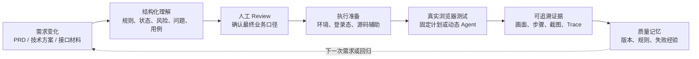
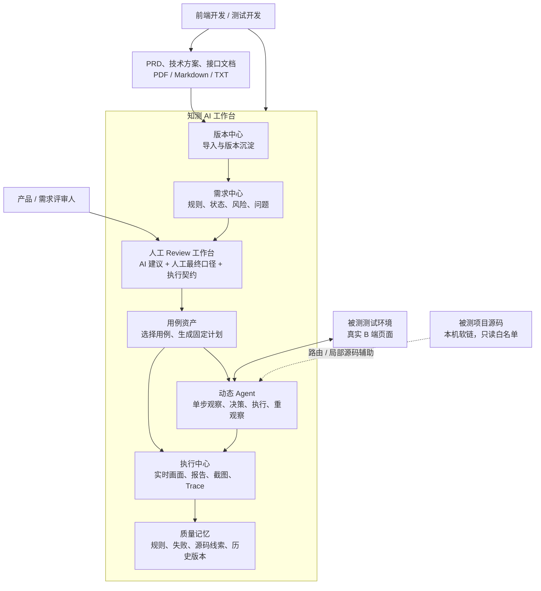
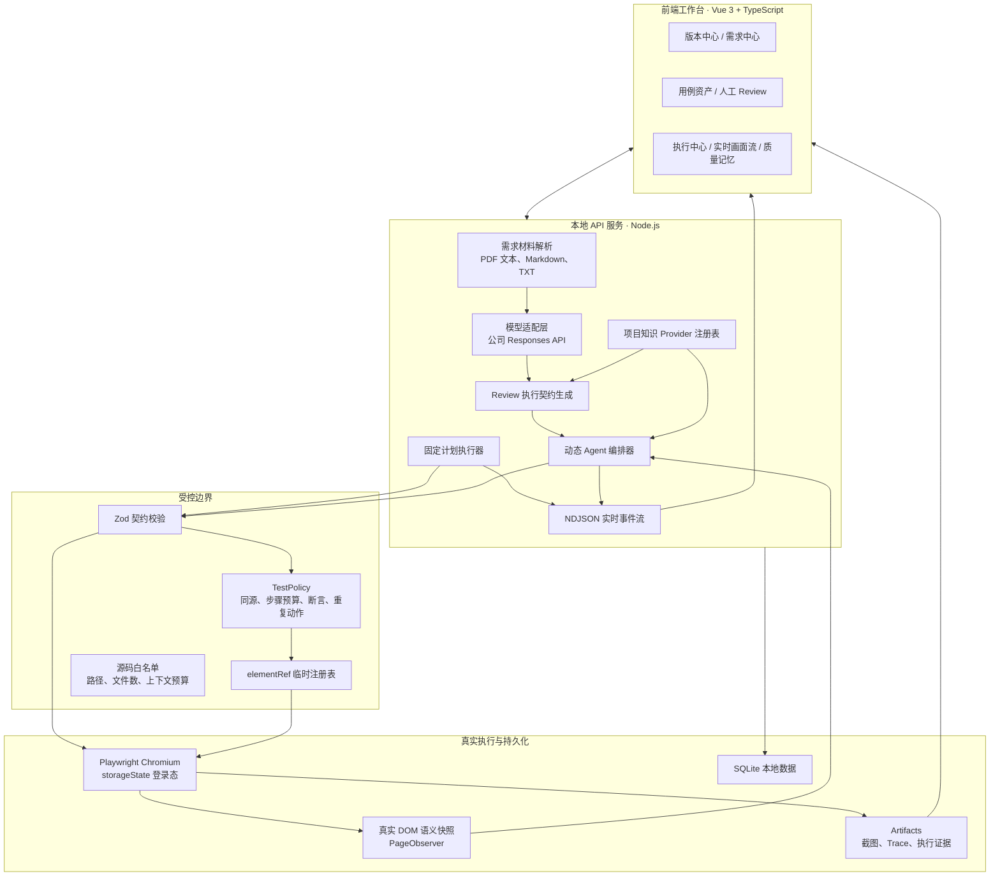
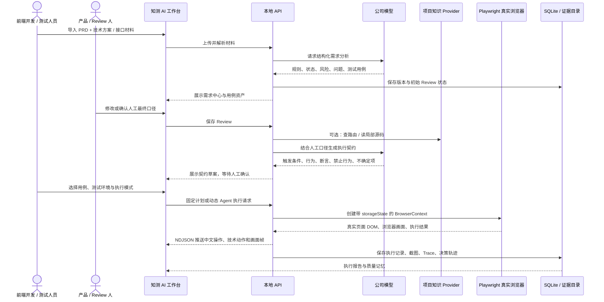
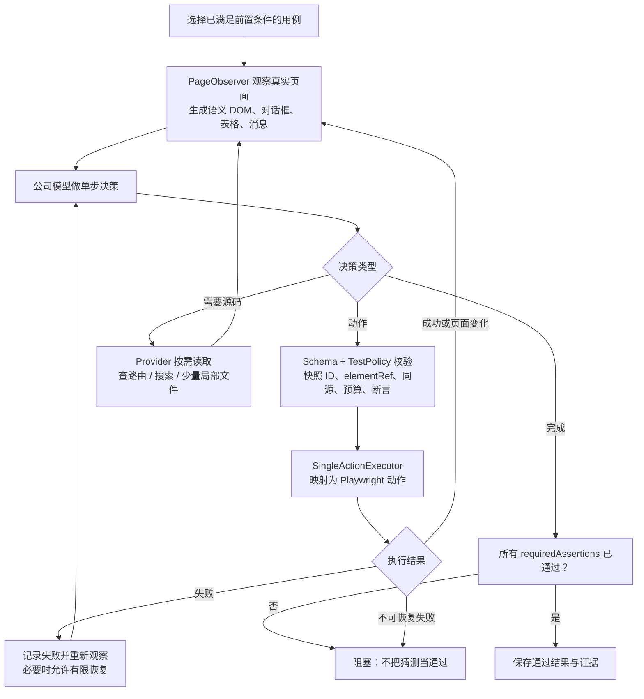
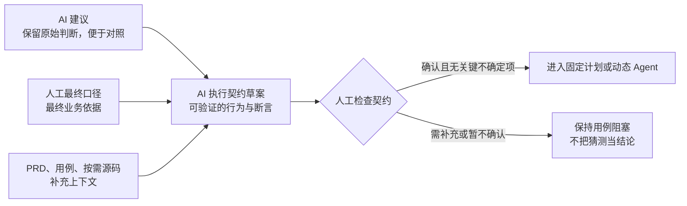
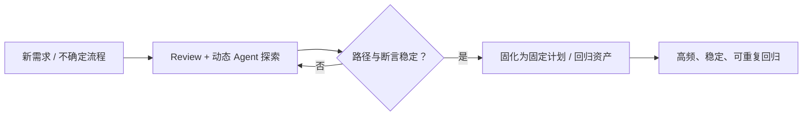

# 知测 AI 项目汇报文档

> 面向重业务 B 端前端团队的 AI 测试工作台。本文基于当前 `quality-ai` 实现整理，用于项目汇报、技术分享与后续迭代对齐。

## 1. 一句话说明项目

**知测 AI 不是“让模型直接写一段 Playwright 脚本”的工具，而是把“需求材料 → 人工业务口径 → 测试用例 → 真实浏览器执行 → 可追溯证据与质量记忆”串成一个受控闭环的测试工作台。**

它服务的核心对象是前端开发、测试开发和参与需求评审的产品同学，尤其适合老师平台这类：

- 页面复杂、角色与权限多、登录态不可缺少的 B 端系统；
- PRD、接口文档、技术方案分散，规则并不总是写完整；
- 下拉框、表格、弹窗、批量操作等复合组件多，固定定位容易脆弱；
- 出错后需要知道“浏览器当时看到了什么、为什么点这里、失败在哪一步”，而不只是拿到一个失败结论。

项目和被测项目（例如 `lvworkbench`）保持独立：知测 AI 通过本机软链配置在允许范围内**按需只读**源码，不修改被测项目代码，也不把源码当成运行时事实。

---

## 2. 它解决的实际问题

### 2.1 从前端开发者的真实工作视角出发

假设你接到一个“批量生成报告”的需求：产品给了 PRD，研发给了部分接口说明；你需要登录测试环境，找到正确菜单和路由，验证考试选择、异常反馈、重复提交、下载结果等行为。

现实中会连续遇到这些问题：

| 传统工作中的卡点 | 实际后果 | 知测 AI 的对应做法 |
| --- | --- | --- |
| PRD 写了主流程，但异常、重复操作、字段格式等细节不完整 | 测试用例要么遗漏，要么测试人员自行猜测 | 将材料拆为业务规则、页面状态、待确认问题和测试用例；不确定项明确暴露出来 |
| 产品确认只是一段自然语言，例如“失败后提示并可重试” | 这句话不能直接变成可执行的点击和断言 | 保留 AI 建议，单独保存人工最终口径，再生成可审查的执行契约 |
| B 端页面需要登录、权限、特定账号数据 | 本地或无登录浏览器根本到不了待测页面 | 测试环境保存目标地址，并导入 Playwright `storageState` 复用登录态 |
| 模型只看 PRD 时不知道页面在什么路由、控件如何组织 | 容易生成不存在的选择器，或走错页面 | 在 DOM 信息不足时，按 URL 查路由、搜索相关源码、读取少量局部文件，再回到真实页面验证 |
| 直接让模型输出任意脚本 | 能力看似很强，但副作用不可控、定位不稳定、失败难复盘 | 模型只能选择平台定义的受控动作；动作先校验，再映射为 Playwright API |
| 执行记录只有“失败”和一段超时日志 | 开发者无法快速判断是环境、权限、页面渲染还是定位问题 | 保存步骤、截图、Trace、Agent 决策轨迹和源码使用线索；执行时还可看实时画面流 |
| 每个版本、每次失败都从零开始重新理解 | 质量知识留在个人聊天记录或脑中 | 版本、规则、问题确认、用例、执行记录与失败经验本地持久化，形成质量记忆 |

### 2.2 项目的核心目标

项目的目标不是替代开发者或测试人员做业务决策，而是降低下面三种成本：

1. **理解成本**：把分散的需求材料转成研发、产品、测试可以共同查看的结构化资产。
2. **落地成本**：把人工确认的业务规则逐步收敛成可在真实页面验证的测试目标，而不是直接让模型猜脚本。
3. **排障成本**：把执行过程中的浏览器画面、操作目的、底层动作、DOM 观察、源码线索和证据留存下来，让失败能被复盘和复用。

因此，项目的价值闭环可以概括为：

---

## 3. 整体示意图：谁在什么时候使用它

这张图表达两个关键点：

- **人始终在决策链中**：产品或测试人员可以修改 AI 的建议并保存最终业务口径；未确认或仍有不确定项的关键用例不能直接进入执行。
- **真实浏览器始终在证据链中**：源码、PRD 和模型推理用于辅助理解，页面最终是否这样表现必须由 Playwright 控制的真实页面来验证。

---

## 4. 方案设计图：当前系统结构

### 4.1 结构上的关键设计选择

| 设计选择 | 为什么这样做 | 带来的实际收益 |
| --- | --- | --- |
| `quality-ai` 与被测项目分离 | 测试平台不能因为“辅助理解源码”而影响业务项目 | 可接入本地软链项目，读取范围受配置限制，不改 `lvworkbench` |
| Provider 抽象项目知识 | 项目接入方式、路由组织和源码目录会变化 | 当前通过 `ProjectKnowledgeProvider` 统一提供项目状态、路由解析、源码搜索和局部读取能力 |
| 模型输出结构化 JSON，而非任意代码 | 任意 Playwright/JavaScript 容易越权，也难审计 | 需求分析、执行契约、固定计划和单步决策都有 Schema 校验 |
| 动态 Agent 使用单步循环 | B 端页面状态会随菜单、异步加载、弹窗、权限改变 | 每一步都重新观察 DOM，避免用旧快照连续盲点 |
| 源码只做“线索” | 源码中的逻辑未必等于当前环境的实际运行状态 | Agent 读到路由或组件后仍要回到真实 DOM 执行与断言 |
| 执行过程流式化 | 等全部完成再看报告，排障反馈太慢 | 浏览器画面、中文操作说明和技术动作通过 NDJSON 实时展示 |
| 证据与状态持久化 | 一次执行不能只留下终态 | SQLite 保存版本、Review、计划和执行记录；文件系统保存截图与 Trace |

---

## 5. 流程示意图：一次需求到执行的完整路径

### 5.1 动态 Agent 的内部闭环

动态 Agent 用于“固定脚本还不够稳定、页面路径或组件状态需要探索”的情况。它不是一次生成长脚本，而是每一步只作一个受控决定。

这个闭环专门解决此前 B 端页面常见的“模型点到了隐藏的同名元素、旧页面快照已失效、页面只渲染了壳但内容尚未加载”等问题。当前动态动作协议支持导航、点击、输入、选择、勾选、按键、悬浮、滚动、可见/隐藏/可用/选中/值/文本/属性/数量断言、等待和截图等受控操作；模型不能直接执行任意 CSS、XPath 或 JavaScript。

---

## 6. 当前已有功能、能做什么、服务什么场景

| 功能模块 | 当前能做什么 | 典型使用场景 | 对开发者的价值 |
| --- | --- | --- | --- |
| 版本中心 | 导入多份需求材料，形成版本记录并可切换历史版本 | 一个迭代同时有 PRD、技术方案、接口补充文档 | 不再把不同版本的测试结论混在一起 |
| 需求材料解析 | 支持 PDF、Markdown、TXT 联合解析；区分主需求材料和补充技术材料 | 产品给 PDF PRD，研发给接口文档 | 一次获得统一的需求上下文；文本型 PDF 可直接解析，扫描件需要先 OCR |
| 需求中心 | 展示需求摘要、风险、业务规则及其材料依据、页面状态模型、待确认问题 | 需求评审、开发前自检、测试设计评审 | 从“读一堆文档”变为“先看规则和状态” |
| 待确认问题 | 明确记录材料无法唯一确定的规则，并保留 AI 建议 | 重复提交、失败提示、文件命名、异步完成时机等未写清楚 | 把隐性假设变成可追踪的待决事项 |
| 人工 Review 工作台 | AI 建议保留；人工可写最终口径、暂不确认或确认保存；可生成执行规则草案 | 产品说“按这个理解做”，但表述未必足够技术化 | 人的业务判断不会被模型建议覆盖，也不会因刷新丢失 |
| 执行契约 | 将人工口径转为目标、触发条件、页面行为、可验证断言、禁止行为、源码线索和不确定项 | “生成失败应提示原因、保留表单并允许重试” | 人工自然语言先被解释成可检查对象；仍有不确定项时阻止冒险执行 |
| 用例资产 | 展示 AI 生成的主流程、分支、边界、异常、回归、交互、空数据、数据契约等用例，并可选择 | 选择本次需要执行的 P0/P1 回归范围 | 用例是可管理资产，不是一次性聊天输出 |
| 测试环境与登录态 | 保存测试页面地址、校验 Origin，并导入 `storageState` 复用登录状态 | 老师平台需要特定账号、权限、组织数据 | 真实浏览器直接进入可测状态；登录凭据不回传到界面 |
| 固定计划执行 | 将选择用例转为受控 DSL，使用真实 Chromium 执行、截图、保存结果，支持重跑 | 已经稳定、重复频率高的回归场景 | 适合固化成熟路径，获得稳定可复现的回归执行 |
| 动态 Agent 执行 | 在真实页面上单步观察、决策、执行和重新观察；DOM 不足时可按需读取源码 | 菜单路径复杂、组件行为未知、固定定位失败后的探索性测试 | 不必提前把所有细节写死，但仍保留动作和副作用边界 |
| 源码辅助 Provider | 根据 URL 解析路由，搜索允许范围内源码，读取有限局部文件 | 页面只显示应用外壳，或需要理解功能路由、组件、接口处理位置 | 源码辅助定位与理解，避免全量喂代码或手工全局搜索 |
| 执行中心 | 集中查看成功、失败、受阻、步骤耗时、失败原因、截图和 Trace | 自动化失败后的第一次排查 | 让“失败了”变成“哪一步、什么页面状态、哪类错误” |
| Playwright 实时画面流 | 执行期间展示同一个 Playwright 页面当前画面、中文操作说明、目的和原始动作；关闭后可再次打开 | 不想等测试结束才知道卡在哪里 | `click e10` 仍可保留给技术人员，同时展示“点击‘批量操作’”这类可理解信息 |
| 质量记忆 | 汇总版本规则、失败/受阻执行、源码使用线索与历史版本 | 同类需求第二次开发或复测 | 把团队经验从个人记忆变为可查的项目资产 |
| 使用引导与前置提示 | 各工作区提供“如何使用”入口，操作前提示材料、确认、环境等条件 | 初次使用或跨角色协作 | 降低“按钮点了没反应”“不知道下一步”的使用成本 |

---

## 7. 人工 Review 为什么是核心，而不是附属功能

AI 对待确认问题给出的只是建议，不能天然等于业务事实。例如 AI 可能建议“失败后允许重试”，但产品真实规则可能是“失败后展示原因，只有网络错误允许重试，业务校验错误不允许重试”。

因此系统采用三层信息模型：

### 7.1 执行时到底以谁为准

下面不是简单的优先级替换，而是一条有边界的证据链：

| 信息 | 在执行中的定位 |
| --- | --- |
| 人工最终口径 | 最终业务依据；写入测试目标 |
| 已确认的执行契约 | 把业务语言拆成触发、行为、断言和禁止行为；用于约束 Agent 和计划生成 |
| 选中的测试用例与 PRD | 提供前置条件、操作目标和预期结果 |
| Provider 源码线索 | 帮助找路由和理解实现；必须回到页面验证，不能直接判定通过 |
| 真实 DOM、页面消息和可访问性状态 | 运行时事实；Playwright 以此执行并完成断言 |
| 模型原始建议 | 用于对照和追溯，不会自动覆盖人工决定 |

这样，即使人工口径写得不够技术化，模型也能结合 PRD、选中用例和**允许读取的局部源码**提出执行契约；但模型无法补足的关键点会被列为 `uncertainties`，需要人继续补充，而不是被默默“合理化”。

---

## 8. 参考 DSH 的哪些能力，做了哪些本项目优化

这里的“参考 DSH”指的是借鉴其 Agent 工程化的能力模型与架构思路，**不是在当前项目中直接运行 DSH、Cordis 或 DSH 插件运行时**。当前落地的是知测 AI 自己的 TypeScript 接口、事件协议和执行器。

| DSH 中值得学习的能力/思想 | 在知测 AI 中的落地优化 | 解决的具体问题 |
| --- | --- | --- |
| Provider 抽象 | 定义 `ProjectKnowledgeProvider`，把项目状态、路由解析、源码搜索、局部文件读取统一为接口 | 被测项目不与测试平台耦合；接入新项目时不需要把业务代码复制进测试工具 |
| 工作区隔离与受限能力访问 | 使用本机软链连接目标项目；限定 `sourceRoots`、扩展名、排除目录、文件数和上下文字符预算 | 能参考真实实现，又避免全仓扫描、误读构建产物或改动被测项目 |
| 事件驱动的过程可观测性 | 设计 `LiveExecutionEvent`，以 NDJSON 推送开始、活动、浏览器画面和完成事件 | 用户不再只能等最终结果；可以实时看到浏览器做了什么、为什么这么做 |
| 工具/动作协议，而非自然语言直接执行 | `AgentDecision`、`AgentAction`、Zod Schema、`SingleActionExecutor`、`TestPolicy` 组成受控动作链 | 避免模型临时创造动作、直接运行任意脚本或使用不稳定的自由选择器 |
| 单步 Agent 循环 | 真实 DOM 观察 → 单步决策 → 校验 → Playwright 执行 → 重观察；必要时再请求 Provider | 适配异步渲染、菜单展开、弹窗、动态下拉等 B 端状态变化，避免旧定位连续失效 |
| 人在回路中的协作机制 | AI 建议、人工最终口径、执行契约三层分离；未确认或契约有不确定项时阻塞执行 | 模型负责整理和推理，人负责业务裁决，降低“AI 自信但错误”的风险 |
| Agent 轨迹与长期记忆 | 保存决策轨迹、页面观察摘要、源码上下文、执行证据和质量记忆 | 失败可复盘，成功路径可逐步固化为固定回归计划 |

### 8.1 对“Cordis、事件系统、Provider”三个知识点的项目化理解

| 学习点 | 不应只停留在的层面 | 在本项目中真正发挥的作用 |
| --- | --- | --- |
| Cordis / 插件化思想 | 只背服务注册、上下文、生命周期概念 | 把“项目源码知识”变成可替换 Provider，未来可扩展 Git、接口文档、测试数据、下载文件等受控能力 |
| 事件系统 | 只知道 emit/on 的写法 | 把执行过程设计成明确事件：开始、活动、浏览器帧、完成、错误；前端可以稳定恢复和展示状态 |
| Provider | 只知道抽象接口 | 将软链项目、白名单、路由解析和局部源码读取隔离在 Provider 内，Agent 不直接碰文件系统 |

换句话说，这些学习点的价值不在于“项目里用了多少个框架名词”，而在于让能力具有清晰边界：**谁提供信息、谁做决策、谁执行浏览器动作、谁保存证据、谁对业务结果负责。**

---

## 9. 对外汇报时可以强调的差异化价值

### 9.1 与普通“AI 生成测试用例”相比

普通方案通常停在“文档 → 一份用例文本”或“模型 → 一段测试脚本”。知测 AI 增加了三个关键环节：

1. **需求不确定性显式化**：问题没确认就不假装能稳定执行。
2. **真实页面验证**：源码和模型只辅助，最终仍在真实浏览器中看 DOM、状态与提示。
3. **执行可解释性**：执行时看到中文业务动作与画面，结束后还能回看 Trace、截图、失败原因和决策轨迹。

### 9.2 与纯固定 Playwright 回归相比

固定脚本适合稳定、高频、路径明确的回归；动态 Agent 适合探索页面路径、理解复合组件或在固定定位失效后辅助排查。二者不是互相替代，而是分工：

这是更符合实际团队演进的方式：先用 Agent 降低探索成本，再把验证过的路径沉淀为成本更低、稳定性更高的固定资产。

---

## 10. 当前边界与使用前提

为保证汇报准确，当前项目也明确保留以下边界：

- 动态 Agent 的目标是受控测试探索，不开放任意 JavaScript、XPath 或无限制选择器；动作能力会根据真实 B 端场景逐步补充。
- Provider 只读源码，且有项目配置、来源目录、文件数量和上下文预算限制；源码结论必须由真实 DOM 验证。
- 执行真实环境前，需要准备合规的测试账号、测试数据和 `storageState`；系统会校验测试环境与目标页面的 Origin。
- 文本型 PDF 可直接提取内容；扫描件 PDF 需要先 OCR，才能作为有效需求材料。
- 当前约定范围内，**敏感信息检测与脱敏、多 Agent 协作、跨项目 Manifest 发布**尚未实现；这三项不应在现阶段对外承诺。
- 实时画面流是只读的 Playwright 页面画面，不是 iframe 中的第二个网页实例，也暂不支持人工接管鼠标键盘。

这些边界不是能力缺失的掩饰，而是为了让“AI 辅助测试”先做到可控、可复盘、可逐步扩展。

---

## 11. 推荐的三分钟演示路径

如果需要向研发或管理者展示项目，建议按真实开发节奏演示，而不是从架构图开始：

1. **导入材料**：上传一份 PRD 和一份技术方案，展示系统如何生成规则、状态、风险、问题和用例。
2. **处理一个不确定问题**：在人工 Review 中保留 AI 建议，输入人工最终口径，生成并检查执行契约。
3. **连接真实环境**：选择已配置的测试地址、登录态和源码项目，说明软链 Provider 只读、按需使用。
4. **动态执行**：展示实时 Playwright 画面，重点解释“正在执行 TC-003”对应的中文操作、目的和技术动作。
5. **查看证据**：进入执行中心查看通过/失败、截图、Trace 和 Agent 轨迹；最后展示质量记忆如何保留这次经验。

这样听众先理解它解决了什么实际协作问题，再理解为什么需要 Provider、事件流、单步 Agent 和执行契约这些设计。

---

## 12. 术语对照（便于非测试开发同学理解）

| 名称 | 在知测 AI 中的含义 |
| --- | --- |
| PRD 分析 | 将原始材料转换成需求、规则、状态、问题、用例的结构化结果 |
| 人工最终口径 | 产品或测试人员对某个待确认问题给出的最终业务结论 |
| 执行契约 | 将人工口径进一步拆成可检查的触发、行为、断言、禁止行为与不确定项 |
| Provider | 被 Agent 按需调用的受控能力接口；当前最重要的是项目源码知识 Provider |
| 语义 DOM 快照 | 从真实页面提取的精简、可理解、可定位的页面信息，而不是把完整 HTML 全塞给模型 |
| `elementRef` | 当前快照中临时分配的元素编号，例如 `e10`；用于让 Agent 指向已观察到的真实元素 |
| Playwright | 实际启动 Chromium、点击、输入、断言、截图并生成 Trace 的浏览器自动化工具 |
| 固定计划 | 预先生成的、步骤固定的受控 DSL，适合稳定回归 |
| 动态 Agent | 每一步重新观察页面后再决定下一步的测试执行模式，适合探索和恢复 |
| Trace / 截图 | Playwright 的执行证据，用于复盘页面当时的状态和失败位置 |

## 结语

知测 AI 的核心不是“多一个能点网页的 AI”，而是让前端质量工作形成一条可协作、可解释、可验证、可积累的路径：**让 AI 加速理解和探索，让人保留业务裁决权，让真实浏览器提供最终证据。**
